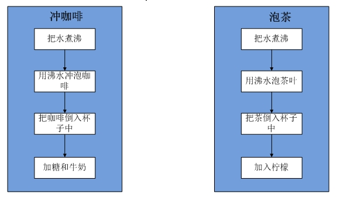
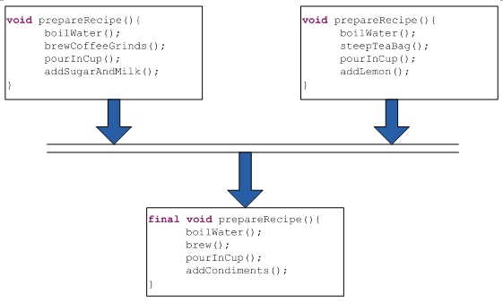
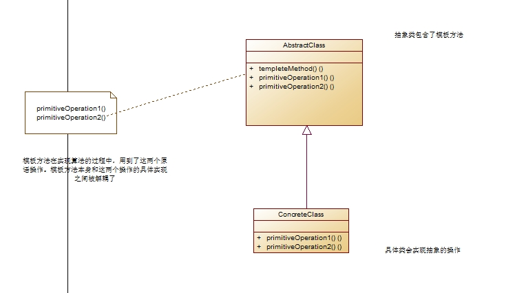
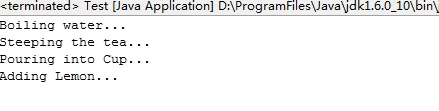
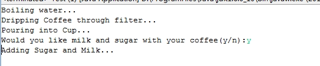

<h1>首先我们</h1>先来看两个例子：冲咖啡和泡茶。冲咖啡和泡茶的基本流程如下：

所以用代码来创建如下：

咖啡:Caffee.java

    
    
     1 public class Coffee {
     2     void prepareRecipe(){
     3         boilWater();
     4         brewCoffeeGrinds();
     5         pourInCup();
     6         addSugarAndMilk();
     7     }
     8     
     9     void boilWater(){
    10         System.out.println("Boiling water...");
    11     }
    12     
    13     public void brewCoffeeGrinds(){
    14         System.out.println("Dripping Coffee through filter...");
    15     }
    16     
    17 
    18     void pourInCup(){
    19         System.out.println("Pouring into Cup...");
    20     }
    21     
    22     public void addSugarAndMilk(){
    23         System.out.println("Adding Sugar and Milk...");
    24     }
    25 }

茶：Tea.java

    
    
     1 public class Tea {
     2     void prepareRecipe(){
     3         boilWater();
     4         steepTeaBag();
     5         pourInCup();
     6         addLemon();
     7     }
     8     
     9     void boilWater(){
    10         System.out.println("Boiling water...");
    11     }
    12     
    13     public void steepTeaBag(){
    14         System.out.println("Steeping the tea...");
    15     }
    16     
    17 
    18     void pourInCup(){
    19         System.out.println("Pouring into Cup...");
    20     }
    21     
    22     public void addLemon(){
    23         System.out.println("Adding Lemon...");
    24     }
    25 }

通过上面两个类的实现我们发现一些重复的代码。从一开始接触设计模式，我们就知道这样一个设计原则：将用中需要变化的部分取出并“封装”起来，即我们需要将某些相同代码抽象出来。根据这个原则我们可以确认这个应用中存在两个不变的部分：把水煮沸、把茶倒入杯子中，需要变化的有：用沸水冲泡咖啡(茶)、加入糖和牛奶(加入柠檬)。所以这里需要将这个变化部分抽象出来，交由子类去实现。

我们再仔细看看这两个步骤还有什么相同之处呢？这里我们发现用沸水冲泡咖啡和泡茶叶存在一个共同点，那就是用沸水冲泡,只不过冲泡的对象不同罢了，加入糖和牛奶(柠檬)同样的道理，都是加入调料，只不过加入的调料不同而已。所以这里可以将prepareRecipe()方法做如下修改：

做了上面的一些修改，我们可以看出泡咖啡和泡茶将共用一个相同的泡法(算法)：

把水煮沸——>用沸水冲泡——>倒入杯子中——>加入调料。

通过上面的一些简要的介绍，对模板方法模式有了一个初步的认识。那么什么是模板方法模式呢？

# 一、模式定义

所谓模板方法模式就是在一个方法中定义一个算法的骨架，而将一些步骤延迟到子类中。模板方法使得子类可以在不改变算法结构的情况下，重新定义算法中的某些步骤。

模板方法模式是基于继承的代码复用技术的。在模板方法模式中，我们可以将相同部分的代码放在父类中，而将不同的代码放入不同的子类中。也就是说我们需要声明一个抽象的父类，将部分逻辑以具体方法以及具体构造函数的形式实现，然后声明一些抽象方法让子类来实现剩余的逻辑，不同的子类可以以不同的方式来实现这些逻辑。

其实所谓模板就是一个方法，这个方法将算法的实现定义成了一组步骤，其中任何步骤都是可以抽象的，交由子类来负责实现。这样就可以保证算法的结构保持不变，同时由子类提供部分实现。

模板是一个方法，那么他与普通的方法存在什么不同呢？模板方法是定义在抽象类中，把基本操作方法组合在一起形成一个总算法或者一组步骤的方法。而普通的方法是实现各个步骤的方法，我们可以认为普通方法是模板方法的一个组成部分。

# 二、模式结构

从上面的结构可以看出，模板方法模式就两个角色：

AbstractClass: 抽象类

ConcreteClass: 具体子类

其中抽象类提供一组算法和部分逻辑的实现，具体子类实现剩余逻辑。

#  三、模式实现

使用上面的泡咖啡和泡茶。

首先是抽象类，该抽象类提供了冲泡咖啡或者茶的具体流程，并且实现了逻辑步骤，煮沸水和倒入杯子中。将用沸水冲泡和加入调料交由具体的子类(咖啡、茶)来实现。

    
    
     1 public abstract class CaffeineBeverage {
     2     
     3     /**
     4      * 
     5      * @desc 
     6      *             模板方法，用来控制泡茶与冲咖啡的流程
     7      *             申明为final，不希望子类覆盖这个方法，防止更改流程的执行顺序
     8      * @return void
     9      */
    10     final void prepareRecipe(){
    11         boilWater();
    12         brew();
    13         pourInCup();
    14         addCondiments();
    15     }
    16     
    17     /**
    18      * @desc 
    19      *          将brew()、addCondiment()声明为抽象类，具体操作由子类实现
    20      * @return void
    21      */
    22     abstract void brew();
    23     
    24     abstract void addCondiments();
    25     
    26     void boilWater(){
    27         System.out.println("Boiling water...");
    28     }
    29     
    30     void pourInCup(){
    31         System.out.println("Pouring into Cup...");
    32     }
    33 }

然后是具体的子类实现：

Coffee.java

    
    
     1 public class Coffee extends CaffeineBeverage{
     2 
     3     void addCondiments() {
     4         System.out.println("Adding Sugar and Milk...");
     5     }
     6 
     7     void brew() {
     8         System.out.println("Dripping Coffee through filter...");
     9     }
    10 
    11 }

Tea.java

    
    
     1 public class Tea extends CaffeineBeverage{
     2 
     3     void addCondiments() {
     4         System.out.println("Adding Lemon...");
     5         
     6     }
     7 
     8     void brew() {
     9         System.out.println("Steeping the tea...");
    10     }
    11 
    12 }

完成，做了这么久终于可以泡杯咖啡来喝了。

    
    
    1 public class Test {
    2     public static void main(String[] args) {
    3         Tea tea = new Tea();
    4         tea.prepareRecipe();
    5     }
    6 }

    
    
       从上面的运行结果可以看出，我们的模板方法模式表现的非常良好，但是我们似乎忽略了一些东西？如果某些客户并不喜欢加入调料，而喜欢原生态的，但是我们的算法总是会给客户加入调料，怎么解决？

遇到这个问题我们可以使用钩子。所谓钩子就是一种被声明在抽象类中的方法，但只有空的或者默认的实现。钩子的存在可以使子类能够对算法的不同点进行挂钩，即让子类能够对模板方法中某些即将发生变化的步骤做出相应的反应。当然要不要挂钩，由子类决定。

所以对于上面的要求，我们可以做出如下修改。

    
    
     1 public abstract class CaffeineBeverageWithHook {
     2     
     3     void prepareRecipe(){
     4         boilWater();
     5         brew();
     6         pourInCup();
     7         if(customerWantsCondiments()){    //如果顾客需要添加调料，我们才会调用addCondiments()方法
     8             addCondiments();
     9         }
    10     }
    11     
    12     abstract void brew();
    13     
    14     abstract void addCondiments();
    15     
    16     void boilWater(){
    17         System.out.println("Boiling water...");
    18     }
    19     
    20     void pourInCup(){
    21         System.out.println("Pouring into Cup...");
    22     }
    23     
    24     public boolean customerWantsCondiments(){
    25         return true;
    26     }
    27 }

客户是否需要加入调料，只需要回答y或者n

    
    
     1 public class CoffeeWithHook extends CaffeineBeverageWithHook{
     2     void addCondiments() {
     3         System.out.println("Adding Sugar and Milk...");
     4     }
     5 
     6     void brew() {
     7         System.out.println("Dripping Coffee through filter...");
     8     }
     9     
    10     /**
    11      * 覆盖该钩子，提供自己的实现方法
    12      */
    13     public boolean customerWantsCondiments(){
    14         if("y".equals(getUserInput().toLowerCase())){
    15             return true;
    16         }
    17         else{
    18             return false;
    19         }
    20     }
    21 
    22     public String getUserInput(){
    23         String answer = null;
    24         System.out.print("Would you like milk and sugar with your coffee(y/n):");
    25         BufferedReader in = new BufferedReader(new InputStreamReader(System.in));
    26         try {
    27             answer = in.readLine();
    28         } catch (IOException e) {
    29             e.printStackTrace();
    30         }
    31         if(answer == null){
    32             return "n";
    33         }
    34         return answer;
    35         
    36     }
    37 }

测试程序

    
    
    1 public class Test {
    2     public static void main(String[] args) {
    3         CoffeeWithHook coffeeHook = new CoffeeWithHook();
    4         coffeeHook.prepareRecipe();
    5     }
    6 }    

运行结果

从上面可以看出钩子能够作为条件来进行控制。

# 四、模式优缺点

优点

1、模板方法模式在定义了一组算法，将具体的实现交由子类负责。

2、模板方法模式是一种代码复用的基本技术。

3、模板方法模式导致一种反向的控制结构，通过一个父类调用其子类的操作，通过对子类的扩展增加新的行为，符合“开闭原则”。

缺点

每一个不同的实现都需要一个子类来实现，导致类的个数增加，是的系统更加庞大。

# 五、使用场景

1、 一次性实现一个算法的不变的部分，并将可变的行为留给子类来实现。

2、 各子类中公共的行为应被提取出来并集中到一个公共父类中以避免代码重复。

3、控制子类的扩展。

# 六、模式总结

1、 模板方法模式定义了算法的步骤，将这些步骤的实现延迟到了子类。

2、 模板方法模式为我们提供了一种代码复用的重要技巧。

3、 模板方法模式的抽象类可以定义抽象方法、具体方法和钩子。

4、 为了防止子类改变算法的实现步骤，我们可以将模板方法声明为final。

