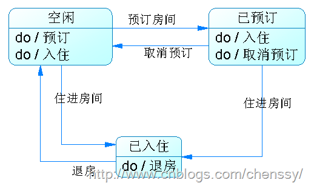
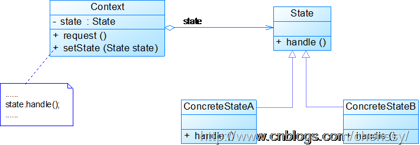
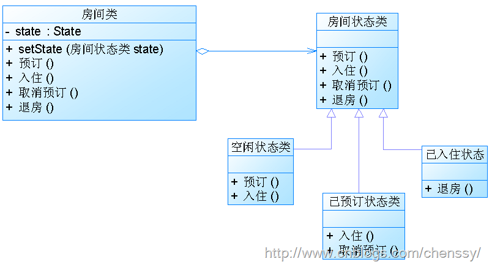
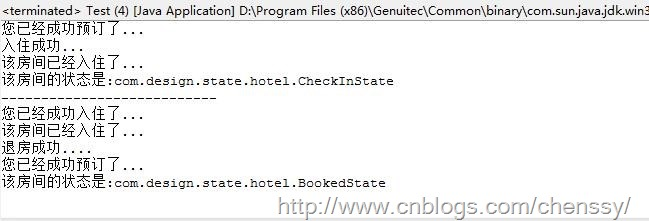

在介绍状态模式之前，我们先来看这样一个实例：你公司力排万难终于获得某个酒店的系统开发项目，并且最终落到了你的头上。下图是他们系统的主要工作(够简单)。

当你第一眼看到这个系统的时候你就看出来了这是一个状态图，每个框框都代表了房间的状态，箭头表示房间状态的转换。分析如下：房间有三个状态：空闲、已预订、已入住，状态与状态之间可以根据客户的动作来进行转换。定义每个状态的值。

    
    
    public static final int FREEMTIME_STATE = 0;  //空闲状态
        public static final int BOOKED_STATE = 1;     //已预订状态
        public static final int CHECKIN_STATE = 2;    //入住状态
        
        
        int state = FREEMTIME_STATE;     //初始状态

通过客户的动作将每个状态整合起来，对于这个“最简单”的方式肯定是if…else
if…else啦！所以这里我们就通过动作将所有的状态全面整合起来。分析得这里有四个动作：预订、入住、退订、退房。如下：

    
    
    /**
         * @desc 预订
         * @return void
         */
        public void bookRoom(){
            if(state == FREEMTIME_STATE){   //空闲可预订
                if(count > 0){
                    System.out.println("空闲房间，完成预订...");
                    state =  BOOKED_STATE;     //改变状态：已预订
                    count --;
                    //房间预订完了,提示客户没有房源了
                    if(count == 0){
                        System.out.println("不好意思,房间已经预订完,欢迎您下次光临...");
                    }
                }
                else{
                    System.out.println("不好意思,已经没有房间了....");
                }
            }
            else if(state == BOOKED_STATE){
                System.out.println("该房间已经被预订了...");
            }
            else if(state == CHECKIN_STATE){
                System.out.println("该房间已经有人入住了...");
            }
        }
        
        /**
         * @desc 入住
         * @return void
         */
        public void checkInRoom(){
            if(state == FREEMTIME_STATE){
                if(count > 0){
                    System.out.println("空闲房间，入住...");
                    state =  CHECKIN_STATE;     //改变状态：已预订
                    count --;
                    //房间预订完了,提示客户没有房源了
                    if(count == 0){
                        System.out.println("不好意思,房间已经预订完,欢迎您下次光临...");
                    }
                }
                else{
                    System.out.println("不好意思,已经没有房间了....");
                }
                
            }
            else if(state == BOOKED_STATE){
                if("如果该房间是您预订的"){
                    System.out.println("入住....");
                    state = CHECKIN_STATE;
                }
                else{
                    System.out.println("您没有预订该房间,请先预订...");
                }
            }
            else if(state == CHECKIN_STATE){
                System.out.println("该房间已经入住了...");
            }
        }
        
        /**
         * @desc 退订
         * @return void
         */
        public void unsubscribeRoom(){
            if(state == FREEMTIME_STATE){
            }
            else if(state == CHECKIN_STATE){
                
            }
            else if(state == BOOKED_STATE){
                System.out.println("已退订房间...");
                state = FREEMTIME_STATE;
                count ++;
            }
        }
        
        /**
         * @desc 退房
         * @return void
         */
        public void checkOutRoom(){
            if(state == FREEMTIME_STATE){
                
            }
            else if(state == BOOKED_STATE){
                
            }
            else if(state == CHECKIN_STATE){
                System.out.println("已退房..");
                state = FREEMTIME_STATE;
                count++;
            }
        }

对于上面的代码你是否满意呢？满意那么你就没有必要往下看了，不满意我们接着讲。

正当你完成这个“复杂”if..else if
…else时(我都写了一会儿)，你客户说，我们需要将某些房间保留下来以作为备用(standbyState)，于是你发现你悲剧了，因为你发现你要在所有的操作里都要判断该房间是否为备用房间。当你老大经过你身边的时候发现你正在纠结怎么改的时候，你老大就问你为什么不换一个角度思考以状态为原子来改变它的行为，而不是通过行为来改变状态呢？于是你就学到了
**状态模式。**

# 一、模式定义

在很多情况下，一个对象的行为取决于它的一个或多个变化的属性，这些属性我们称之为状态，这个对象称之为状态对象。对于状态对象而已，它的行为依赖于它的状态，比如你要预订房间，那么只有当该房间为空闲时你才能预订，你想入住该房间也只有当你预订了该房间或者该房间为空闲时。对于这样的一个对象，当它在于外部事件产生互动的时候，其内部状态就会发生改变，从而使得他的行为也随之发生改变。

那么何为状态模式呢？ 所谓状态模式就是允许对象在内部状态发生改变时改变它的行为，对象看起来好像修改了它的类。

# 二、模式结构

下图为状态模式的UML图。

状态模式包含如下角色：  
Context: 环境类。可以包括一些内部状态。  
State: 抽象状态类。State定义了一个所有具体状态的共同接口，任何状态都实现这个相同的接口，这样一来，状态之间就可以互相转换了。  
ConcreteState:
具体状态类。具体状态类，用于处理来自Context的请求，每一个ConcreteState都提供了它对自己请求的实现，所以，当Context改变状态时行为也会跟着改变。

# 三、模式实现

依然是上面那个酒店的实例。对于该实例的UML图如下：

首先是状态接口：State

    
    
    public interface State {
        /**
         * @desc 预订房间
         * @return void
         */
        public void bookRoom();
        
        /**
         * @desc 退订房间
         * @return void
         */
        public void unsubscribeRoom();
        
        /**
         * @desc 入住
         * @return void
         */
        public void checkInRoom();
        
        /**
         * @desc 退房
         * @return void
         */
        public void checkOutRoom();
        
    }

然后是房间类

    
    
    public class Room {
        /*
         * 房间的三个状态
         */
        State freeTimeState;    //空闲状态
        State checkInState;     //入住状态
        State bookedState;      //预订状态
    
        State state ;  
        
        public Room(){
            freeTimeState = new FreeTimeState(this);
            checkInState = new CheckInState(this);
            bookedState = new BookedState(this);
            
            state = freeTimeState ;  //初始状态为空闲
        }
        
        /**
         * @desc 预订房间
         * @return void
         */
        public void bookRoom(){
            state.bookRoom();
        }
        
        /**
         * @desc 退订房间
         * @return void
         */
        public void unsubscribeRoom(){
            state.unsubscribeRoom();
        }
        
        /**
         * @desc 入住
         * @return void
         */
        public void checkInRoom(){
            state.checkInRoom();
        }
        
        /**
         * @desc 退房
         * @return void
         */
        public void checkOutRoom(){
            state.checkOutRoom();
        }
    
        public String toString(){
            return "该房间的状态是:"+getState().getClass().getName();
        }
        
        /*
         * getter和setter方法
         */
        
        public State getFreeTimeState() {
            return freeTimeState;
        }
    
        public void setFreeTimeState(State freeTimeState) {
            this.freeTimeState = freeTimeState;
        }
    
        public State getCheckInState() {
            return checkInState;
        }
    
        public void setCheckInState(State checkInState) {
            this.checkInState = checkInState;
        }
    
        public State getBookedState() {
            return bookedState;
        }
    
        public void setBookedState(State bookedState) {
            this.bookedState = bookedState;
        }
    
        public State getState() {
            return state;
        }
    
        public void setState(State state) {
            this.state = state;
        }
    
    }

然后是3个状态类,这个三个状态分别对于这:空闲、预订、入住。其中空闲可以完成预订和入住两个动作，预订可以完成入住和退订两个动作，入住可以退房。

    
    
    /** 
     * @project: design_state 
     * @author chenssy
     * @date 2013-8-24 
     * @Description: 空闲状态只能预订和入住
     */
    public class FreeTimeState implements State {
        
        Room hotelManagement;
        
        public FreeTimeState(Room hotelManagement){
            this.hotelManagement = hotelManagement;
        }
        
        
        public void bookRoom() {
            System.out.println("您已经成功预订了...");
            hotelManagement.setState(hotelManagement.getBookedState());   //状态变成已经预订
        }
    
        public void checkInRoom() {
            System.out.println("您已经成功入住了...");
            hotelManagement.setState(hotelManagement.getCheckInState());   //状态变成已经入住
        }
    
        public void checkOutRoom() {
            //不需要做操作
        }
    
        public void unsubscribeRoom() {
            //不需要做操作
        }
    
    }
    
    
    /** 
     * @project: design_state 
     * @author chenssy
     * @date 2013-8-24 
     * @Description: 入住状态房间只能退房
     */
    public class BookedState implements State {
        Room hotelManagement;
        
        public BookedState(Room hotelManagement) {
            this.hotelManagement = hotelManagement;
        }
    
        public void bookRoom() {
            System.out.println("该房间已近给预定了...");
        }
    
        public void checkInRoom() {
            System.out.println("入住成功..."); 
            hotelManagement.setState(hotelManagement.getCheckInState());         //状态变成入住
        }
    
        public void checkOutRoom() {
            //不需要做操作
        }
    
        public void unsubscribeRoom() {
            System.out.println("退订成功,欢迎下次光临...");
            hotelManagement.setState(hotelManagement.getFreeTimeState());   //变成空闲状态
        }
    
    }
    
    
    /** 
     * @project: design_state 
     * @author chenssy
     * @date 2013-8-24 
     * @Description: 入住可以退房
     */
    public class CheckInState implements State {
        Room hotelManagement;
        public CheckInState(Room hotelManagement) {
            this.hotelManagement = hotelManagement;
        }
    
        public void bookRoom() {
            System.out.println("该房间已经入住了...");
        }
    
        public void checkInRoom() {
            System.out.println("该房间已经入住了...");
        }
    
        public void checkOutRoom() {
            System.out.println("退房成功....");
            hotelManagement.setState(hotelManagement.getFreeTimeState());     //状态变成空闲
        }
    
        public void unsubscribeRoom() {
            //不需要做操作
        }
    
    }

最后是测试类

    
    
    public class Test {
        public static void main(String[] args) {
            //有3间房
            Room[] rooms = new Room[2];
            //初始化
            for(int i = 0 ; i < rooms.length ; i++){
                rooms[i] = new Room();
            }
            //第一间房
            rooms[0].bookRoom();    //预订
            rooms[0].checkInRoom();   //入住
            rooms[0].bookRoom();    //预订
            System.out.println(rooms[0]);
            System.out.println("---------------------------");
            
            //第二间房
            rooms[1].checkInRoom();
            rooms[1].bookRoom();
            rooms[1].checkOutRoom();
            rooms[1].bookRoom();
            System.out.println(rooms[1]);
        }
    
    }

运行结果

# 四、模式优缺点

## 优点

1、封装了转换规则。  
2、枚举可能的状态，在枚举状态之前需要确定状态种类。  
3、将所有与某个状态有关的行为放到一个类中，并且可以方便地增加新的状态，只需要改变对象状态即可改变对象的行为。  
4、允许状态转换逻辑与状态对象合成一体，而不是某一个巨大的条件语句块。  
5、可以让多个环境对象共享一个状态对象，从而减少系统中对象的个数。

## 缺点

1、状态模式的使用必然会增加系统类和对象的个数。  
2、状态模式的结构与实现都较为复杂，如果使用不当将导致程序结构和代码的混乱。  
3、状态模式对“开闭原则”的支持并不太好，对于可以切换状态的状态模式，增加新的状态类需要修改那些负责状态转换的源代码，否则无法切换到新增状态；而且修改某个状态类的行为也需修改对应类的源代码。

# 五、模式适用场景

1、对象的行为依赖于它的状态（属性）并且可以根据它的状态改变而改变它的相关行为。  
2、代码中包含大量与对象状态有关的条件语句

# 六、模式总结

  
1、状态模式允许一个对象基于内部状态而拥有不同的行为。

2、Context会将行为委托给当前状态对象。

3、状态模式对“开闭原则”支持不是很好。

