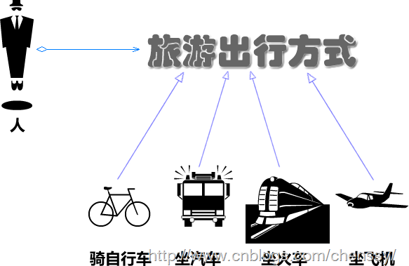
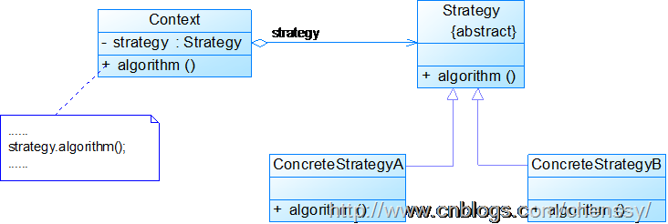
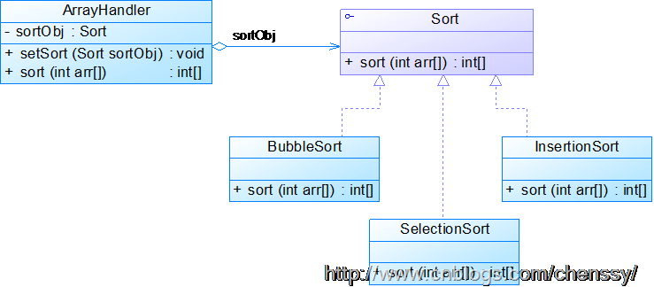

首先我们需要知道策略模式与状态模式是如此的相似，就犹如一对双胞胎一样。只不过状态模式是通过改变对象内部的状态来帮助对象控制自己的行为，而策略模式则是围绕可以互换的算法来创建成功业务的。两者都可用于解决同一个问题：带有大量的if..else…等条件判断语句来进行选择的（小弟初学，不知这样理解是否有误??有误望指出…）。

在我们的生活中我们可以通过很多种不同的方式来完成一件事情，这里的每一种方式都可以称作为一种策略。我们可以根据环境、条件等因素的不同选择不同的策略来完成这件事情。比如说出去旅游，我们可以选择坐火车、坐飞机、坐大巴、骑自行车，甚至徒步等等方式。如果想舒适快速我们可以选择飞机，节约钱我们可以选择火车和大巴，离家近的我们可以骑自行车，每一种方式都可以到达目的地。但是总有一种方式是当前最适合你的。你会选择哪种出行方式呢？

在软件开发过程中是一样的，我们可能有很多种方法可以实现某一个功能，但是我们需要一种简单、高效的途径可以使得系统能够灵活的解决问题。这就是策略模式的设计动机。

# 一、模式定义

在前面中对策略模式应该有了一个最初步的认识。那么什么是策略模式呢？所谓策略模式就是定义了算法族，分别封装起来，让他们之前可以互相转换，此模式然该算法的变化独立于使用算法的客户。

在软件系统中有很多种方法可以实现同一个功能，比如排序算法它有冒泡排序、选择排序、快速排序、插入排序等等。这里我们有一种硬编码方法，就是讲所以的排序算法全部写在一个类中，每一种算法的具体实现对应着一个方法，然后写一个总方法通过if…else…来判断选择具体的排序算法，但是这样做存在几个问题。

第一：如果需要增加新的算法，则需要修改源代码。

第二：如果更新了排序算法，那么需要在客户端也需要修改代码，麻烦。

第三：充斥着大量的if…else…语句，代码维护比较困难。

所以为了解决这些问题，我们可以定义一些独立的类来封装不同的算法，每一个独立的类对应着一个具体的算法实现，在这里我们就将这里每一个独立的类称之为一个策略。

# 二、模式结构

下图为策略模式的结构：

这个UML图与状态模式的几乎一模一样，状态模式是通过改变对象内部的状态来帮助对象控制自己的行为，我们可以这样理解状态模式其实是对状态进行封装，它是将动作动作的实现和责任进行分割，把动作委托到代表当前状态的对象。而策略模式是对算法进行封装，把算法的责任和算法本身进行分割开来，同时委派给不同的对象进行管理。策略模式是将一个系列的算法封装到一系列的策略里面。

其实对于算法的选择，策略模式并不关心，它只是对算法进行封装，至于算法什么时候什么地方使用什么算法都是客户所决定的，这样就提高了系统的灵活性，但同时也增加了客户的负担，因为客户需要清楚知道选择什么样的算法对自己最有利，这就需要客户对每一个算法都清楚知道他们的区别。

# 三、模式实现

我们都知道排序算法有很多种，但是什么时候选择冒泡排序，什么时候选择选择排序，什么时候选择插入排序，所以这里用排序算法来演示策略模式的实现。  
首先我们先来看看在没有使用策略模式的情况。

    
    
    public void selectSort(String type){
            if("type1".equals(type)){
                //选择快速排序
            }
            else if("type2".equals(type)){
                //选择插入排序
            }
            else if("type3".equals(type)){
                //选择冒泡排序
            }
            else if("type4".equals(type)){
                //选择选择排序
            }
            ......
        }

对于这样的代码实现，除了代码中充斥着大量的if…else
if…else,导致程序可维护性很差，而且系统的可扩展性不好，如果某个排序模块进行更改了，有可能需要修改源代码。所以在对于这样的情景是非常合适使用策略模式的。

那么如何使用策略模式呢？首先我们需要定义一个接口，该接口提供排序算法，然后定义想要的排序算法，实现给接口即可。如下：

首先是Sort接口，该接口定义了排序算法，所有的排序算法都应该实现该接口。

    
    
    public interface Sort{
        public abstract int[] sort(int arr[]);
    }

然后是三个具体的排序算法，他们实现Sort接口。

冒泡排序：BubbleSort.java

    
    
    public class BubbleSort implements Sort{
        public int[] sort(int arr[]){
           int len=arr.length;
           for(int i=0;i<len;i++){
               for(int j=i+1;j<len;j++){
                  int temp;
                  if(arr[i]>arr[j]){
                      temp=arr[j];
                      arr[j]=arr[i];
                      arr[i]=temp;
                  }             
               }
            }
            System.out.println("冒泡排序");
            return arr;
        }
    }

插入排序：InsertionSort.java

    
    
    public class InsertionSort implements Sort {
        public int[] sort(int arr[]) {
            int len = arr.length;
            for (int i = 1; i < len; i++) {
                int j;
                int temp = arr[i];
                for (j = i; j > 0; j--) {
                    if (arr[j - 1] > temp) {
                        arr[j] = arr[j - 1];
    
                    } else
                        break;
                }
                arr[j] = temp;
            }
            System.out.println("插入排序");
            return arr;
        }
    }

选择排序：SelectSort.java

    
    
    public class SelectionSort implements Sort {
        public int[] sort(int arr[]) {
            int len = arr.length;
            int temp;
            for (int i = 0; i < len; i++) {
                temp = arr[i];
                int j;
                int samllestLocation = i;
                for (j = i + 1; j < len; j++) {
                    if (arr[j] < temp) {
                        temp = arr[j];
                        samllestLocation = j;
                    }
                }
                arr[samllestLocation] = arr[i];
                arr[i] = temp;
            }
            System.out.println("ѡ������");
            return arr;
        }
    }

最后就是测试类客户端了Client.java

    
    
    public class ArrayHandler
    {
        private Sort sortObj;
        
        public int[] sort(int arr[])
        {
            sortObj.sort(arr);
            return arr;
        }
    
        public void setSortObj(Sort sortObj) {
            this.sortObj = sortObj; 
        }
    }
    
    
    public class Client
    {
        public static void main(String args[])
        {
           int arr[]={1,4,6,2,5,3,7,10,9};
           int result[];
           ArrayHandler ah=new ArrayHandler();
           
           Sort sort = new SelectionSort();    //使用选择排序
           
           ah.setSortObj(sort); //设置具体策略
           result=ah.sort(arr);
           
           for(int i=0;i<result.length;i++)
           {
                   System.out.print(result[i] + ",");
           }
        }
    }

运行结果

選擇排序  
1,2,3,4,5,6,7,9,10,

# 四、模式优缺点

## 优点

1、策略模式提供了对“开闭原则”的完美支持，用户可以在不修改原有系统的基础上选择算法或行为，也可以灵活地增加新的算法或行为。  
2、策略模式提供了可以替换继承关系的办法。  
3、使用策略模式可以避免使用多重条件转移语句。

## 缺点

1、客户端必须知道所有的策略类，并自行决定使用哪一个策略类。  
2、策略模式将造成产生很多策略类，

# 五、使用场景

1、如果在一个系统里面有许多类，它们之间的区别仅在于它们的行为，那么使用策略模式可以动态地让一个对象在许多行为中选择一种行为。  
2、一个系统需要动态地在几种算法中选择一种。  
3、如果一个对象有很多的行为，如果不用恰当的模式，这些行为就只好使用多重的条件选择语句来实现。

