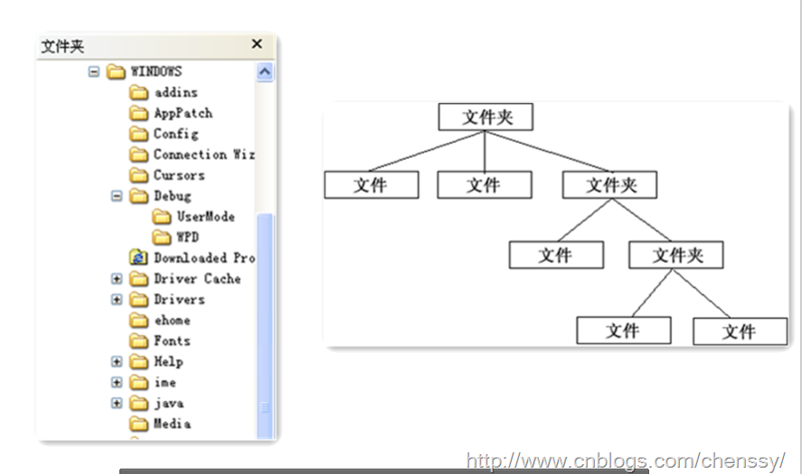
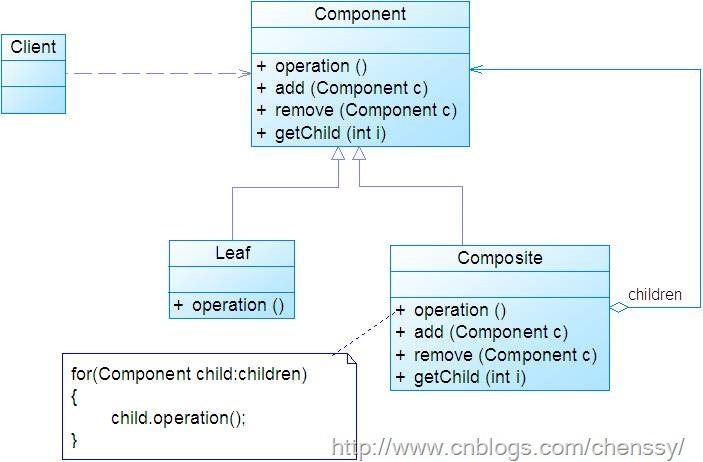
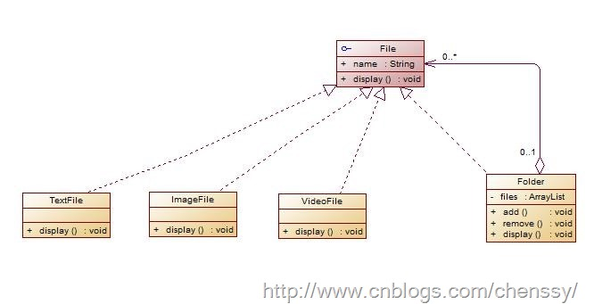
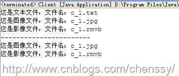

我们对于这个图片肯定会非常熟悉，这两幅图片我们都可以看做是一个文件结构，对于这样的结构我们称之为树形结构。在数据结构中我们了解到可以通过调用某个方法来遍历整个树，当我们找到某个叶子节点后，就可以对叶子节点进行相关的操作。我们可以将这颗树理解成一个大的容器，容器里面包含很多的成员对象，这些成员对象即可是容器对象也可以是叶子对象。但是由于容器对象和叶子对象在功能上面的区别，使得我们在使用的过程中必须要区分容器对象和叶子对象，但是这样就会给客户带来不必要的麻烦，作为客户而已，它始终希望能够一致的对待容器对象和叶子对象。这就是组合模式的设计动机：组合模式定义了如何将容器对象和叶子对象进行递归组合，使得客户在使用的过程中无须进行区分，可以对他们进行一致的处理。

# 一、 模式定义

组合模式组合多个对象形成树形结构以表示“整体-部分”的结构层次。

组合模式对单个对象(叶子对象)和组合对象(组合对象)具有一致性，它将对象组织到树结构中，可以用来描述整体与部分的关系。同时它也模糊了简单元素(叶子对象)和复杂元素(容器对象)的概念，使得客户能够像处理简单元素一样来处理复杂元素，从而使客户程序能够与复杂元素的内部结构解耦。

上面的图展示了计算机的文件系统，文件系统由文件和目录组成，目录下面也可以包含文件或者目录，计算机的文件系统是用递归结构来进行组织的，对于这样的数据结构是非常适用使用组合模式的。

在使用组合模式中需要注意一点也是组合模式最关键的地方：叶子对象和组合对象实现相同的接口。这就是组合模式能够将叶子节点和对象节点进行一致处理的原因。

# 二、 模式结构

组合模式主要包含如下几个角色：

1.Component ：组合中的对象声明接口，在适当的情况下，实现所有类共有接口的默认行为。声明一个接口用于访问和管理Component子部件。  
2.Leaf：叶子对象。叶子结点没有子结点。  
3.Composite：容器对象，定义有枝节点行为，用来存储子部件，在Component接口中实现与子部件有关操作，如增加(add)和删除(remove)等。

从模式结构中我们看出了叶子节点和容器对象都实现Component接口，这也是能够将叶子对象和容器对象一致对待的关键所在。

# 三、 模式实现

在文件系统中，可能存在很多种格式的文件，如果图片，文本文件、视频文件等等，这些不同的格式文件的浏览方式都不同，同时对文件夹的浏览就是对文件夹中文件的浏览，但是对于客户而言都是浏览文件，两者之间不存在什么差别，现在只用组合模式来模拟浏览文件。UML结构图：

首先是文件类：File.java

    
    
    public abstract class File {
        String name;
        
        public File(String name){
            this.name = name;
        }
        
        public String getName() {
            return name;
        }
    
        public void setName(String name) {
            this.name = name;
        }
    
        public abstract void display();
    }

然后是文件夹类：Folder.java，该类包含对文件的增加、删除和浏览三个方法

    
    
    public class Folder extends File{
        private List<File> files;
        
        public Folder(String name){
            super(name);
            files = new ArrayList<File>();
        }
        
        /**
         * 浏览文件夹中的文件
         */
        public void display() {
            for(File file : files){
                file.display();
            }
        }
        
        /**
         * @desc 向文件夹中添加文件
         * @param file
         * @return void
         */
        public void add(File file){
            files.add(file);
        }
        
        /**
         * @desc 从文件夹中删除文件
         * @param file
         * @return void
         */
        public void remove(File file){
            files.remove(file);
        }
    }

然后是三个文件类：TextFile.java、ImageFile.java、VideoFile.java

TextFile.java

    
    
    public class TextFile extends File{
    
        public TextFile(String name) {
            super(name);
        }
    
        public void display() {
            System.out.println("这是文本文件，文件名：" + super.getName());
        }
        
    }

ImageFile.java

    
    
    public class ImagerFile extends File{
    
        public ImagerFile(String name) {
            super(name);
        }
    
        public void display() {
            System.out.println("这是图像文件，文件名：" + super.getName());
        }
    
    }

VideoFile.java

    
    
    public class VideoFile extends File{
    
        public VideoFile(String name) {
            super(name);
        }
    
        public void display() {
            System.out.println("这是影像文件，文件名：" + super.getName());
        }
    
    }

最后是客户端

    
    
    public class Client {
        public static void main(String[] args) {
            /**
             * 我们先建立一个这样的文件系统
             *                  总文件
             *                  
             *   a.txt    b.jpg                   c文件夹              
             *                      c_1.text  c_1.rmvb    c_1.jpg   
             *                                                       
             */ 
            //总文件夹
            Folder zwjj = new Folder("总文件夹");
            //向总文件夹中放入三个文件：1.txt、2.jpg、1文件夹
            TextFile aText= new TextFile("a.txt");
            ImagerFile bImager = new ImagerFile("b.jpg");
            Folder cFolder = new Folder("C文件夹");
            
            zwjj.add(aText);
            zwjj.add(bImager);
            zwjj.add(cFolder);
            
            //向C文件夹中添加文件：c_1.txt、c_1.rmvb、c_1.jpg 
            TextFile cText = new TextFile("c_1.txt");
            ImagerFile cImage = new ImagerFile("c_1.jpg");
            VideoFile cVideo = new VideoFile("c_1.rmvb");
            
            cFolder.add(cText);
            cFolder.add(cImage);
            cFolder.add(cVideo);
            
            //遍历C文件夹
            cFolder.display();
            //将c_1.txt删除
            cFolder.remove(cText);
            System.out.println("-----------------------");
            cFolder.display();
        }
    }

运行结果

# 四、 模式优缺点

## 优点

1、可以清楚地定义分层次的复杂对象，表示对象的全部或部分层次，使得增加新构件也更容易。

2、客户端调用简单，客户端可以一致的使用组合结构或其中单个对象。

3、定义了包含叶子对象和容器对象的类层次结构，叶子对象可以被组合成更复杂的容器对象，而这个容器对象又可以被组合，这样不断递归下去，可以形成复杂的树形结构。

4、更容易在组合体内加入对象构件，客户端不必因为加入了新的对象构件而更改原有代码。

## 缺点

1、使设计变得更加抽象，对象的业务规则如果很复杂，则实现组合模式具有很大挑战性，而且不是所有的方法都与叶子对象子类都有关联

# 五、 模式适用场景

1、需要表示一个对象整体或部分层次，在具有整体和部分的层次结构中，希望通过一种方式忽略整体与部分的差异，可以一致地对待它们。

2、让客户能够忽略不同对象层次的变化，客户端可以针对抽象构件编程，无须关心对象层次结构的细节。

# 六、 模式总结

1、 组合模式用于将多个对象组合成树形结构以表示“整体-部分”的结构层次。组合模式对单个对象（叶子对象）和组合对象（容器对象）的使用具有一致性。

2、
组合对象的关键在于它定义了一个抽象构建类，它既可表示叶子对象，也可表示容器对象，客户仅仅需要针对这个抽象构建进行编程，无须知道他是叶子对象还是容器对象，都是一致对待。

3、
组合模式虽然能够非常好地处理层次结构，也使得客户端程序变得简单，但是它也使得设计变得更加抽象，而且也很难对容器中的构件类型进行限制，这会导致在增加新的构件时会产生一些问题。

