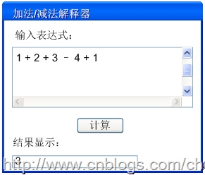
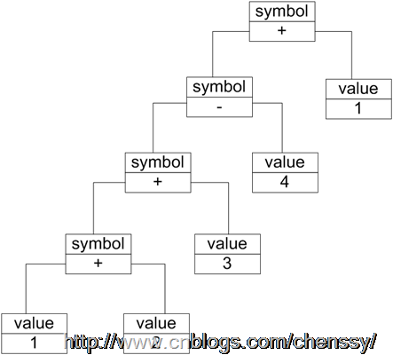
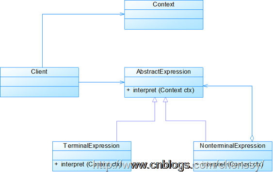
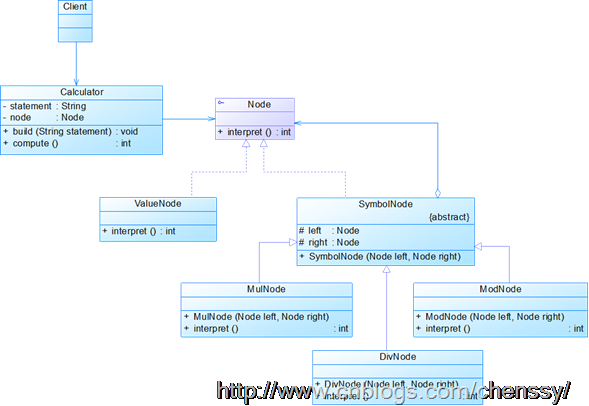
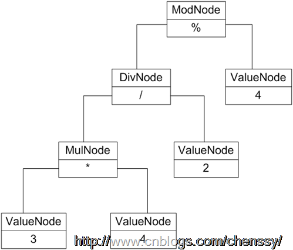

##设计模式读书笔记-----解释器模式

##
## 为人处事是一门大学问，察言观色、听懂弦外之音都是非常重要的，老板跟你说“XX你最近表现平平啊，还得要多努力”，如果你不当回事，平常对待，可能下次就是“XX，恩，你人还是不错，平常工作也很努力，但是我想这份工作可能不是很适合你…..”。又比如你老大说“XX，你最近表现不错，工作积极性很高啊！继续保持啊！”，你高兴乐呵着心想是不是老板要给我加工资了，可能你等到花都谢了也没有，得到的可能会是更多的工作量。对于我们刚刚入社会的人不够圆滑，不会察言观色，更听不懂老板的弦外之音，所以我们期待如果有一个翻译机该多好，直接将别人的弦外之音给翻译出来就好了。  

##
## 在我们实际的生活中是这样，在软件的世界里也同样存在着翻译机，只不过在软件中我们称之为解释器。在系统中如果某一特定类型的问题在频繁的发生，此时我们就有必要将这些问题的实例表述为一个语言中句子，因此可以构建一个解释器，然后利用该解释器来解释这些句子来解决这些问题。  

##
##   一、 模式定义  

##
## 所谓解释器模式就是定义语言的文法，并且建立一个解释器来解释该语言中的句子。  

##
## 在这里我们将语言理解成使用规定格式和语法的代码。  

##
## 在前面我们知道可以构建解释器来解决那些频繁发生的某一特定类型的问题，在这我们将这些问题的实例表述为一个语言中句子。例如我经常利用正则表达式来检测某些字符串是否符合我们规定的格式。这里正则表达式就是解释器模式的应用，解释器为正则表达式定义了一个文法，如何表示一个特定的正则表达式，以及如何解释这个正则表达式。  

##
## 解释器模式描述了如何构成一个简单的语言解释器，主要应用在使用面向对象语言开发的编译器中。它描述了如何为简单的语言定义一个文法，如何在该语言中表示一个句子，以及如何解释这些句子。  

##
## 在解释器模式中除了能够使用文法规则来定义一个语言，还有通过一个更加直观的方法来表示——使用抽象语法树。抽象语法树能够更好地，更直观地表示一个语言的构成，每一颗抽象语法树对应一个语言实例。  

##
##   二、 模式结构  

##
## 下图是解释器模式的UML结构图。  

##
##   

##
## 解释器模式主要包含如下几个角色：  

##
## AbstractExpression: 抽象表达式。声明一个抽象的解释操作，该接口为抽象语法树中所有的节点共享。  

##
## TerminalExpression: 终结符表达式。实现与文法中的终结符相关的解释操作。实现抽象表达式中所要求的方法。文法中每一个终结符都有一个具体的终结表达式与之相对应。  

##
## NonterminalExpression: 非终结符表达式。为文法中的非终结符相关的解释操作。  

##
## Context: 环境类。包含解释器之外的一些全局信息。  

##
## Client: 客户类。  

##
## 抽象语法树描述了如何构成一个复杂的句子，通过对抽象语法树的分析，可以识别出语言中的终结符和非终结符类。 在解释器模式中由于每一种终结符表达式、非终结符表达式都会有一个具体的实例与之相对应，所以系统的扩展性比较好。  三、 模式实现  

##
## 现在我们用解释器模式来实现一个基本的加、减、乘、除和求模运算。例如用户输入表达式“3 * 4 / 2 % 4”，输出结果为2。下图为该实例的UML结构图：  

##
##   

##
##  

##
## 抽象语法树  

##
##   

##
## 实现过程：  

##
## 抽象表达式：Node.java。     	public interface Node
{
    public int interpret();
	}



##
## 非终结表达式：ValueNode.java。主要用解释该表达式的值。


  	public class ValueNode implements Node
{
    private int value;
    
    public ValueNode(int value)
    {
        this.value=value;
    	}
        
    public int interpret()
    {
        return this.value;
    	}
	}



##
## 终结表达式抽象类，由于该终结表达式需要解释多个运算符号，同时用来构建抽象语法树：


  	public abstract class SymbolNode implements Node
{
    protected Node left;
    protected Node right;
    
    public SymbolNode(Node left,Node right)
    {
        this.left=left;
        this.right=right;
    	}
	}



##
## MulNode.java


  	public class MulNode extends SymbolNode
{
    public MulNode(Node left,Node right)
    {
        super(left,right);
    	}
    
    public int interpret()
    {
        return left.interpret() * right.interpret();
    	}
	}



##
## ModNode.java


  	public class ModNode extends SymbolNode{
    public ModNode(Node left,Node right){
        super(left,right);
    	}
    
    public int interpret(){
        return super.left.interpret() % super.right.interpret();
    	}
	}



##
## DivNode.java


  	public class DivNode extends SymbolNode{
    public DivNode(Node left,Node right){
        super(left,right);
    	}
    
    public int interpret(){
        return super.left.interpret() / super.right.interpret();
    	}
	}



##
## Calculator.java


  	public class Calculator{
    private String statement;
    private Node node;
    
    public void build(String statement){
        Node left=null,right=null;
        Stack stack=new Stack();
        
        String[] statementArr=statement.split(" ");
        
        for(int i=0;i<statementArr.length;i++){    
            if(statementArr[i].equalsIgnoreCase("*")){
                left=(Node)stack.pop();
                int val=Integer.parseInt(statementArr[++i]);
                right=new ValueNode(val); 
                stack.push(new MulNode(left,right));
            	}
            else if(statementArr[i].equalsIgnoreCase("/")){
                left=(Node)stack.pop();
                    int val=Integer.parseInt(statementArr[++i]);
                    right=new ValueNode(val); 
                stack.push(new DivNode(left,right));                
            	}
            else if(statementArr[i].equalsIgnoreCase("%")){
                left=(Node)stack.pop();
                    int val=Integer.parseInt(statementArr[++i]);
                    right=new ValueNode(val); 
                stack.push(new ModNode(left,right));               
            	}
            else{
                stack.push(new ValueNode(Integer.parseInt(statementArr[i])));
            	}
        	}
        this.node=(Node)stack.pop();
    	}
    
    public int compute()
        return node.interpret();
    	}
	}



##
## 客户端：Client.java


  	public class Client{
    public static void main(String args[]){
        String statement = "3 * 2 * 4 / 6 % 5";
        
        Calculator calculator = new Calculator();
        
        calculator.build(statement);
        
        int result = calculator.compute();
        
        System.out.println(statement + " = " + result);    
    	}
	}



##
## 运行结果：3 * 2 * 4 / 6 % 5 = 4

四、 模式优缺点

##优点


##
## 1、 可扩展性比较好，灵活。


##
## 2、 增加了新的解释表达式的方式。


##
## 3、 易于实现文法。

##缺点


##
## 1、 执行效率比较低，可利用场景比较少。


##
## 2、 对于复杂的文法比较难维护。

##五、 模式适用场景


##
## 1、可以将一个需要解释执行的语言中的句子表示为一个抽象语法树。


##
## 2、一些重复出现的问题可以用一种简单的语言来进行表达。


##
## 3、文法较为简单。 

六、 模式总结


##
## 1、在解释器模式中由于语法是由很多类表示的，所以可扩展性强。


##
## 2、虽然解释器的可扩展性强，但是如果语法规则的数目太大的时候，该模式可能就会变得异常复杂。所以解释器模式适用于文法较为简单的。


##
## 3、解释器模式可以处理脚本语言和编程语言。常用于解决某一特定类型的问题频繁发生情况。


##
## 


  

##
##对于这个模式由于LZ水平有限，理解不是很清楚，而且案例实在比较少，所以博文主要以摘抄、记录为主，有点儿囫囵吞枣！！望谅解….