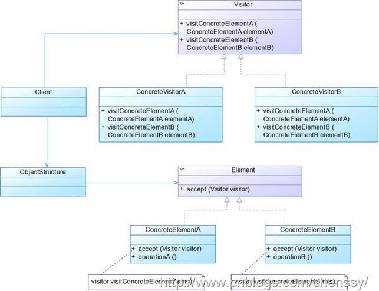
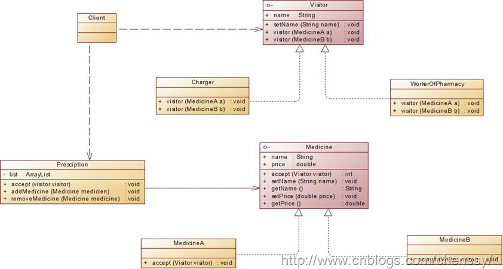

生老病死乃常态，是我们每个人都逃脱不了的，所以进医院就是一件再平常不过的事情了。在医院看病，你首先的挂号，然后找到主治医生，医生呢？先给你稍微检查下，然后就是各种处方单(什么验血、CD、B超等等，太坑了。。。。)，再然后就给你一个处方单要你去拿药。拿药我们可以分为两步走，第一步，我们要去交钱，划价人员会根据你的处方单上面的药进行划价，交钱。第二步，去药房拿药，药房工作者同样根据你的处方单给你相对应的药。

这里我们就划价和拿药两个步骤进行讨论。这里有三个类，处方单（药）、划价人员、药房工作者。同时划价人员和药房工作者都各自有一个动作：划价、拿药。这里进行最初步的设计如下：

划价人员

    
    
    public class Charge {
        public void action(){
            public void action(){
                if("A药".equals(medicine)){
                    //A的价格
                }
                if("B药".equals(medicine)){
                    //B的价格
                }
                if("C药".equals(medicine)){
                    //C的价格
                }
                if("D药".equals(medicine)){
                    //D的价格
                }
                if("E药".equals(medicine)){
                    //E的价格
                }
                ............
            }
        }
    }

药房工作者

    
    
    public class WorkerOfPharmacy {
        public void action(){
            if("A药".equals(medicine)){
                //给你A药
            }
            if("B药".equals(medicine)){
                //给你B药
            }
            if("C药".equals(medicine)){
                //给你C药
            }
            if("D药".equals(medicine)){
                //给你D药
            }
            if("E药".equals(medicine)){
                //给你E药
            }
            ............
        }
    }

看到这样的代码，我们第一个想法就是，这TMD太乱来了吧，这么多的if…else，谁看了不头晕，而且我们可以想象医院里面的药是那么多，而且随时都会增加的，增加了药就要改变划价人员和药房工作者的代码，这是我们最不希望改变的。那么有没有办法来解决呢？有，访问者模式提供一中比较好的解决方案。

在我们实际的软件开发过程中，有时候我们对同一个对象可能会有不同的处理，对相同元素对象也可能存在不同的操作方式，如处方单，划价人员要根据它来划价，药房工作者要根据它来给药。而且可能会随时增加新的操作，如医院增加新的药物。但是这里有两个元素是保持不变的，或者说很少变：划价人员和药房工作中，变的只不过是他们的操作。所以我们想如果能够将他们的操作抽象化就好了。这里访问者模式就是一个值得考虑的解决方案了。

访问者模式的目的是封装一些施加于某种数据结构元素之上的操作，一旦这些操作需要修改的话，接受这个操作的数据结构可以保持不变。为不同类型的元素提供多种访问操作方式，且可以在不修改原有系统的情况下增加新的操作方式，这就是访问者模式的模式动机。

# 一、模式定义

访问者模式即表示一个作用于某对象结构中的各元素的操作，它使我们可以在不改变各元素的类的前提下定义作用于这些元素的新操作。

首先我们要明确一点就是访问者模式适用于数据结构相对稳定的系统。它是将数据的操作与数据结构进行分离了，如果某个系统的数据结构相对稳定，但是操作算法易于变化的话，就比较适用适用访问者模式，因为访问者模式使得算法操作的增加变得比较简单了。

# 二、模式结构

下图是访问者模式的UML结构图：

访问者模式主要包含如下几个角色：

Vistor: 抽象访问者。为该对象结构中的ConcreteElement的每一个类声明的一个操作。  
ConcreteVisitor: 具体访问者。实现Visitor申明的每一个操作，每一个操作实现算法的一部分。  
Element: 抽象元素。定义一个Accept操作，它以一个访问者为参数。  
ConcreteElement: 具体元素 。实现Accept操作。  
ObjectStructure: 对象结构。能够枚举它的元素，可以提供一个高层的接口来允许访问者访问它的元素。

在访问者模式中对象结构存储了不同类型的对象，以便不同的访问者来访问。从上面的UML结构图中我们可以看出，访问者模式主要分为两个层次结构，一个是访问者层次结构，提供了抽象访问者和具体访问者，主要用于什么一些操作。一个是元素层次结构，提供了抽象元素和具体元素，主要用于声明Accept操作。

在访问者模式中相同的访问者可以以不同的方式访问不同的元素，所以在访问者模式中增加新的访问者无需修改现有代码，可扩展行强。

同时在访问者模式用到了一种双分派的技术，所谓双分派技术就是在选择一个方法的时候，不仅仅要根据消息接收者（receiver）的运行时区别（Run time
type），还要根据参数的运行时区别。在访问者模式中，客户端将具体状态当做参数传递给具体访问者，这里完成第一次分派，然后具体访问者作为参数的“具体状态”中的方法，同时也将自己this作为参数传递进去，这里就完成了第二次分派。双分派意味着得到的执行操作决定于请求的种类和接受者的类型。

# 三、模式实现

同样以上面在医院付费、取药为实例。在这个实例中划价员和药房工作者作为访问者，药品作为访问元素、处方单作为对象结构，所以整个UML结构图如下：

抽象访问者：Visitor.java

    
    
    public abstract class Visitor {
        protected String name;
    
        public void setName(String name) {
            this.name = name;
        }
        
        
        public abstract void visitor(MedicineA a);
        
        public abstract void visitor(MedicineB b);
    }

具体访问者：划价员、Charger.java

    
    
    public class Charger extends Visitor{
    
        public void visitor(MedicineA a) {
            System.out.println("划价员：" + name +"给药" + a.getName() +"划价:" + a.getPrice());
        }
    
        public void visitor(MedicineB b) {
            System.out.println("划价员：" + name +"给药" + b.getName() +"划价:" + b.getPrice());
        }
        
    }

具体访问者：药房工作者、WorkerOfPharmacy.java

    
    
    public class WorkerOfPharmacy extends Visitor{
    
        public void visitor(MedicineA a) {
            System.out.println("药房工作者：" + name + "拿药 ：" + a.getName());
        }
    
        public void visitor(MedicineB b) {
            System.out.println("药房工作者：" + name + "拿药 ：" + b.getName());
        }
        
    }

抽象元素：Medicine.java

    
    
    public abstract class Medicine {
        protected String name;
        protected double price;
    
        public Medicine (String name,double price){
            this.name = name;
            this.price = price;
        }
        
        public String getName() {
            return name;
        }
    
        public void setName(String name) {
            this.name = name;
        }
    
        public double getPrice() {
            return price;
        }
        
        public void setPrice(double price) {
            this.price = price;
        }
        
        public abstract void accept(Visitor visitor);
    }

具体元素：MedicineA.java

    
    
    public class MedicineA extends Medicine{
    
        public MedicineA(String name, double price) {
            super(name, price);
        }
    
        public void accept(Visitor visitor) {
            visitor.visitor(this);
        }
    }

具体元素：MedicineB.java

    
    
    public class MedicineB extends Medicine{
    
        public MedicineB(String name, double price) {
            super(name, price);
        }
    
        public void accept(Visitor visitor) {
            visitor.visitor(this);
        }
    }

药单：Presciption.java

    
    
    public class Presciption {
        List<Medicine> list = new ArrayList<Medicine>();
        
        public void accept(Visitor visitor){
            Iterator<Medicine> iterator = list.iterator();
            
            while (iterator.hasNext()) {
                iterator.next().accept(visitor);
            }
        }
        
        public void addMedicine(Medicine medicine){
            list.add(medicine);
        }
        
        public void removeMedicien(Medicine medicine){
            list.remove(medicine);
        }
    }

客户端：Client.java

    
    
    public class Client {
        public static void main(String[] args) {
            Medicine a = new MedicineA("板蓝根", 11.0);
            Medicine b = new MedicineB("感康", 14.3);
            
            Presciption presciption = new Presciption();
            presciption.addMedicine(a);
            presciption.addMedicine(b);
            
            Visitor charger = new Charger();
            charger.setName("张三");
            
            Visitor workerOfPharmacy = new WorkerOfPharmacy();
            workerOfPharmacy.setName("李四");
            
            presciption.accept(charger);
            System.out.println("-------------------------------------");
            presciption.accept(workerOfPharmacy);
        }
    
    }

运行结果

# 四、模式优缺点

## 优点

1、使得新增新的访问操作变得更加简单。

2、能够使得用户在不修改现有类的层次结构下，定义该类层次结构的操作。

3、将有关元素对象的访问行为集中到一个访问者对象中，而不是分散搞一个个的元素类中。

## 缺点

1、增加新的元素类很困难。在访问者模式中，每增加一个新的元素类都意味着要在抽象访问者角色中增加一个新的抽象操作，并在每一个具体访问者类中增加相应的具体操作，违背了“开闭原则”的要求。  
2、破坏封装。当采用访问者模式的时候，就会打破组合类的封装。

3、比较难理解。貌似是最难的设计模式了。

# 五、模式适用场景

1、对象结构中对象对应的类很少改变，但经常需要在此对象结构上定义新的操作。

2、需要对一个对象结构中的对象进行很多不同的并且不相关的操作，而需要避免让这些操作“污染”这些对象的类，也不希望在增加新操作时修改这些类。

# 六、模式总结

1、访问者模式封装了对象结构元素之上的操作，使得新增元素的操作变得非常简单。所以它比较适用于那么对象结构很少变化的类。

2、访问者模式中对象结构存储了不同类型的元素对象，以供不同访问者访问。

