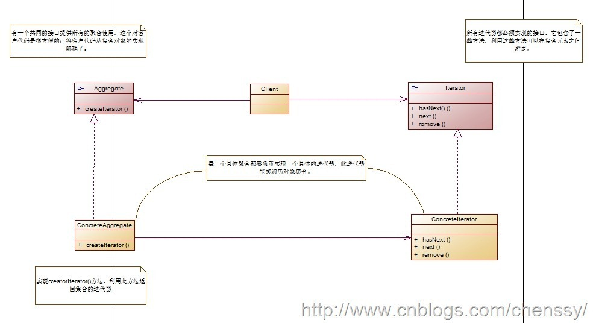
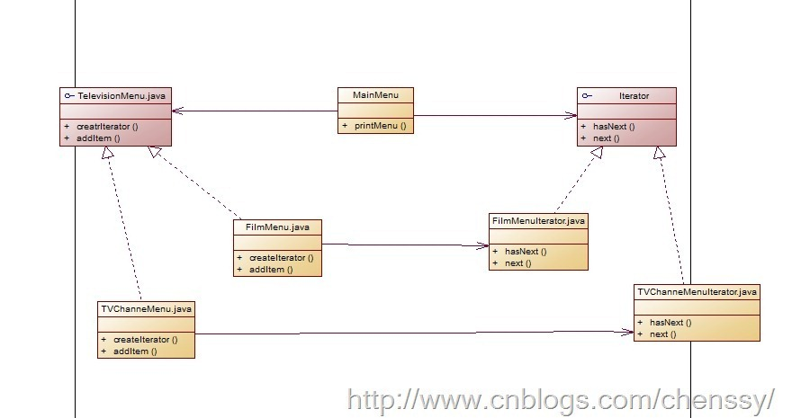
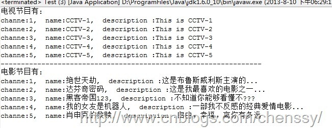

##设计模式读书笔记-----迭代器模式

##
## 你项目组接到一个项目：对电视机的电视频道、电影和收音机菜单进行统一管理，建立一个统一的菜单管理界面，能够看到所有的电视界面、电影界面和收音机频道。你有三个手下：小李子、小杏子、小安子，他们分别就每个模块做开发工作，看他们都做了哪些工作。  

##
## 这是主菜单JavaBean，用于显示每个模块的菜单。     	public class MenuItem {
    private String name;
    private String description;
    private int channe;
    
    public MenuItem(int channe,String name,String description){
        this.name = name;
        this.description = description;
        this.channe = channe;
    	}

    public String getName() {
        return name;
    	}

    public void setName(String name) {
        this.name = name;
    	}

    public String getDescription() {
        return description;
    	}

    public void setDescription(String description) {
        this.description = description;
    	}

    public int getChanne() {
        return channe;
    	}

    public void setChanne(int channe) {
        this.channe = channe;
    	}
    
	}



##
## 小李子负责电视频道菜单的实现。他是使用List实现的，他认为这样就可以非常方便的扩展菜单。


  	public class TVChanneMenu implements TelevisionMenu{
    List<MenuItem> menuItems;
    
    /**
     * 构造函数完成初始化
     */
    public TVChanneMenu(){
        menuItems = new ArrayList<MenuItem>();
        addItem(1, "CCTV-1", "This is CCTV-1");
        addItem(2, "CCTV-2", "This is CCTV-2");
        addItem(3, "CCTV-3", "This is CCTV-3");
        addItem(4, "CCTV-4", "This is CCTV-4");
        addItem(5, "CCTV-5", "This is CCTV-5");
    	}
    
    /**
     * @desc 将电视频道节目添加菜单集合中
     * @param channe  频道
     * @param name  名称
     * @param description  描述
     * @return void
     */
    public void addItem(int channe,String name,String description){
        MenuItem tvMenuItem = new MenuItem(channe, name, description);
        menuItems.add(tvMenuItem);
    	}

    public List<MenuItem> getMenuItems() {
        return menuItems;
    	}

	}



##
## 小杏子负责电影菜单模块的开发。她是使用数组完成的，他认为数组的效率高些，而且能够控制菜单的长度。


  	public class FilmMenu implements TelevisionMenu{
    static final int MAX_ITEMS = 5;    //菜单最大长度
    MenuItem[] menuItems;
    int numberOfItems = 0;
    
    /**
     * 构造函数完成初始化
     */
    public FilmMenu(){
        menuItems = new MenuItem[MAX_ITEMS];
        
        addItem(1, "绝世天劫", "这是布鲁斯威利斯主演的...");
        addItem(2, "达芬奇密码", "这是我最喜欢的电影之一...");
        addItem(3, "黑客帝国123", "不知道你能够看懂不???");
        addItem(4, "我的女友是机器人", "一部我不反感的经典爱情电影...");
        addItem(5, "肖申克的救赎", "自由，幸福，离你有多远");
    	}
    
    /**
     * @desc 将电影解决添加到菜单项中
     * @param channe
     * @param name
     * @param description
     * @return void
     */
    public void addItem(int channe,String name,String description){
        MenuItem tvmenuiItem = new MenuItem(channe, name, description);
        //判断数组是否越界
        if(numberOfItems > MAX_ITEMS){
            System.out.println("不好意思，菜单满了....");
        	}
        else{
            menuItems[numberOfItems] = tvmenuiItem;
            numberOfItems ++;
        	}
    	}

    public MenuItem[] getMenuItems() {
        return menuItems;
    	}

	}



##
## 这里就只介绍两个了。他们完成了各自菜单功能的实现，当你在做三个菜单的统一显示时，你必须要要调用他们的getMenuItems()，来取得他们各个菜单里面的值，但是这个时候问题出现了，你发现他们的返回值都不相同，要想展示出来你必须这么干。


  	List<MenuItem> tvMenuItems = tvMenu.getMenuItems();
        for(int i = 0 ; i < tvMenuItems.size() ; i++){
            MenuItem menuItem = tvMenuItems.get(i);
            ............
        	}

        FilmMenu filmMenu = new FilmMenu();
        MenuItem[] filmItems = filmMenu.getMenuItems();
        for(int i = 0 ; i < filmItems.length ; i++){
            MenuItem menuItem = filmItems[i];
            ............
        	}



##
## 在这里我们总是需要来处理这个两个菜单，通过循环来遍历这些菜单选项，如果小安子的实现也不同呢？是不是得要三个循环呢？如果下次有需要增加一个模块呢？在这里你就恼火了，他们为什么不采用相同的实现方式，但是这个时候你也不可能让他们去更改了，他们有太多的代码在依赖着这个两个菜单了，如果更改就意味着要重写很多的代码了。所以你就想是不是可以来封装循环呢？不错就是封装遍历。这就是迭代器模式的动机--能够游走于聚合内的每一个元素，同时还可以提供多种不同的遍历方式。

一、模式定义


##
## 何谓迭代器模式？所谓迭代器模式就是提供一种方法顺序访问一个聚合对象中的各个元素，而不是暴露其内部的表示。在实际的开发过程中，我们可能需要针对不同的需求，可能需要以不同的方式来遍历整个整合对象，但是我们不希望在聚合对象的抽象接口层中充斥着各种不同的便利操作。这个时候我们就需要这样一种东西，它应该具备如下三个功能：


##
## 1、能够便利一个聚合对象。


##
## 2、我们不需要了解聚合对象的内部结构。


##
## 3、能够提供多种不同的遍历方式。


##
## 这三个功能就是迭代器模式需要解决的问题。作为一个功能强大的模式，迭代器模式把在元素之间游走的责任交给迭代器，而不是聚合对象。这样做就简化了聚合的接口和实现，也可以让聚合更专注在它所应该专注的事情上，这样做就更加符合单一责任原则。

二、模式结构


##
## 下图是迭代器模式UML图。


##
## 


##
## 从上面可以看书迭代器模式有如下几个角色：


##
## Iterator: 抽象迭代器：所有迭代器都需要实现的接口，提供了游走聚合对象元素之间的方法。


##
## ConcreteIterator: 具体迭代器。利用这个具体的迭代器能够对具体的聚合对象进行遍历。每一个聚合对象都应该对应一个具体的迭代器。


##
## Aggregate: 抽象聚合类。


##
## ConcreteAggregate: 具体聚合类。实现creatorIterator()方法，返回该聚合对象的迭代器。

三、模式实现


##
## 下面利用迭代器模式对上面案例进行优化整改。下面是正对该实例的UML图。


##
## 


##
## 首先我们需要定义迭代器接口。Iterator.java


  	public interface Iterator {
    boolean hasNext();
    Object next();
	}



##
## 然后是我们两个具体的迭代器。一个迭代器遍历电视界面、一个迭代器遍历电影界面。


##
## 电影节目的迭代器：FilmMenuIterator.java


  	public class FilmMenuIterator implements Iterator{
    MenuItem[] menuItems;
    int position = 0;
    
    public FilmMenuIterator(MenuItem[] menuItems){
        this.menuItems = menuItems;
    	}
    
    public boolean hasNext() {
        if(position > menuItems.length-1 || menuItems[position] == null){
            return false;
        	}
        return true;
    	}

    public Object next() {
        MenuItem menuItem = menuItems[position];
        position ++;
        return menuItem;
    	}

	}



##
## 电视界面的迭代器：TVChanneMenuIterator.java


  	public class TVChanneMenuIterator implements Iterator{

    List<MenuItem> menuItems;
    int position = 0;
    
    public TVChanneMenuIterator(List<MenuItem> menuItems){
        this.menuItems = menuItems;
    	}
    
    public boolean hasNext() {
        if(position > menuItems.size()-1 || menuItems.get(position) == null){
            return false;
        	}
        else{
            return true;
        	}
    	}

    public Object next() {
        MenuItem menuItem = menuItems.get(position);
        position ++;
        return menuItem;
    	}
	}



##
## 然后是菜单接口，该接口提供返回具体迭代器的方法：createIterator()。


  	public interface TelevisionMenu {
    public void addItem(int channe,String name,String description);
    public Iterator createIrerator();
	}



##
## 两个具体聚合类。这个两个聚合类实现createIterator()方法，分别返回电视界面的聚合类和电影界面的聚合类。


  	public class FilmMenu implements TelevisionMenu{
    static final int MAX_ITEMS = 5;    //菜单最大长度
    MenuItem[] menuItems;
    int numberOfItems = 0;
    
    /**
     * 构造函数完成初始化
     */
    public FilmMenu(){
        menuItems = new MenuItem[MAX_ITEMS];
        
        addItem(1, "绝世天劫", "这是布鲁斯威利斯主演的...");
        addItem(2, "达芬奇密码", "这是我最喜欢的电影之一...");
        addItem(3, "黑客帝国123", "不知道你能够看懂不???");
        addItem(4, "我的女友是机器人", "一部我不反感的经典爱情电影...");
        addItem(5, "肖申克的救赎", "自由，幸福，离你有多远");
    	}
    
    /**
     * @desc 将电影解决添加到菜单项中
     * @param channe
     * @param name
     * @param description
     * @return void
     */
    public void addItem(int channe,String name,String description){
        MenuItem tvmenuiItem = new MenuItem(channe, name, description);
        //判断数组是否越界
        if(numberOfItems > MAX_ITEMS){
            System.out.println("不好意思，菜单满了....");
        	}
        else{
            menuItems[numberOfItems] = tvmenuiItem;
            numberOfItems ++;
        	}
    	}

    public Iterator createIrerator() {
        return new FilmMenuIterator(menuItems);
    	}

	}



##
##


  	public class TVChanneMenu implements TelevisionMenu{
    List<MenuItem> menuItems;
    
    /**
     * 构造函数完成初始化
     */
    public TVChanneMenu(){
        menuItems = new ArrayList<MenuItem>();
        addItem(1, "CCTV-1", "This is CCTV-1");
        addItem(2, "CCTV-2", "This is CCTV-2");
        addItem(3, "CCTV-3", "This is CCTV-3");
        addItem(4, "CCTV-4", "This is CCTV-4");
        addItem(5, "CCTV-5", "This is CCTV-5");
    	}
    
    /**
     * @desc 将电视频道节目添加菜单集合中
     * @param channe  频道
     * @param name  名称
     * @param description  描述
     * @return void
     */
    public void addItem(int channe,String name,String description){
        MenuItem tvMenuItem = new MenuItem(channe, name, description);
        menuItems.add(tvMenuItem);
    	}

    public Iterator createIrerator() {
        return new TVChanneMenuIterator(menuItems);
    	}
    
	}



##
## 终于完成了，现在就可以来实现主菜单了，用来展示、遍历所有的电视、电影界面咯。


  	public class MainMenu {
    TelevisionMenu tvMenu;
    FilmMenu filmMenu;
    
    public MainMenu(TelevisionMenu tvMenu,FilmMenu filmMenu){
        this.tvMenu = tvMenu;
        this.filmMenu  = filmMenu;
    	}
    
    public void printMenu(){
        Iterator tvIterator = tvMenu.createIrerator();
        Iterator filmIterator = filmMenu.createIrerator();
        
        System.out.println("电视节目有:");
        printMenu(tvIterator);
        System.out.println("----------------------------------------------------------------");
        System.out.println("电影节目有:");
        printMenu(filmIterator);
    	}

    private void printMenu(Iterator iterator) {
        while(iterator.hasNext()){
            MenuItem menuItem = (MenuItem) iterator.next();
            System.out.print("channe:"+menuItem.getChanne()+",  ");
            System.out.print("name:"+menuItem.getName()+",  ");
            System.out.println("description :"+menuItem.getDescription());
        	}
    	}
	}



##
## 测试程序：


  	public class Test {
    public static void main(String[] args) {
        TVChanneMenu tvMenu = new TVChanneMenu();
        FilmMenu filmMenu = new FilmMenu();
        
        MainMenu mainMenu = new MainMenu(tvMenu, filmMenu);
        mainMenu.printMenu();
    	}
	}



##
## 运行结果


##
## 

四、模式优缺点

##优点


##
## 1、它支持以不同的方式遍历一个聚合对象。


##
## 2、迭代器简化了聚合类。


##
## 3、在同一个聚合上可以有多个遍历。


##
## 4、在迭代器模式中，增加新的聚合类和迭代器类都很方便，无须修改原有代码。

##缺点


##
## 由于迭代器模式将存储数据和遍历数据的职责分离，增加新的聚合类需要对应增加新的迭代器类，类的个数成对增加，这在一定程度上增加了系统的复杂性。


##
##

五、模式使用场景


##
## 1、访问一个聚合对象的内容而无须暴露它的内部表示。


##
## 2、需要为聚合对象提供多种遍历方式。


##
## 3、为遍历不同的聚合结构提供一个统一的接口。

六、模式总结


##
## 1、迭代器模式提供一种方法来访问聚合对象，而不用暴露这个对象的内部表示。


##
## 2、将遍历聚合对象中数据的行为提取出来，封装到一个迭代器中，通过专门的迭代器来遍历聚合对象的内部数据，这就是迭代器模式的本质。迭代器模式是“单一职责原则”的完美体现。


##
## 3、当使用迭代器的时候，我们依赖聚合提供遍历。


##
## 4、迭代器提供了一个通用的接口，让我们遍历聚合的项，放我们编码使用聚合项时，就可以使用多态机制。