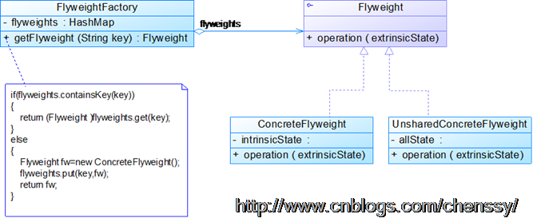
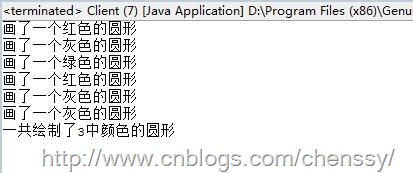

面向对象可以非常方便的解决一些扩展性的问题，但是在这个过程中系统务必会产生一些类或者对象，如果系统中存在对象的个数过多时，将会导致系统的性能下降。对于这样的问题解决最简单直接的办法就是减少系统中对象的个数。

享元模式提供了一种解决方案，使用共享技术实现相同或者相似对象的重用。也就是说实现相同或者相似对象的代码共享。

# 一、 模式定义

所谓享元模式就是运行共享技术有效地支持大量细粒度对象的复用。系统使用少量对象,而且这些都比较相似，状态变化小，可以实现对象的多次复用。

共享模式是支持大量细粒度对象的复用，所以享元模式要求能够共享的对象必须是细粒度对象。

在了解享元模式之前我们先要了解两个概念：内部状态、外部状态。

内部状态：在享元对象内部不随外界环境改变而改变的共享部分。

外部状态：随着环境的改变而改变，不能够共享的状态就是外部状态。

由于享元模式区分了内部状态和外部状态，所以我们可以通过设置不同的外部状态使得相同的对象可以具备一些不同的特性，而内部状态设置为相同部分。在我们的程序设计过程中，我们可能会需要大量的细粒度对象来表示对象，如果这些对象除了几个参数不同外其他部分都相同，这个时候我们就可以利用享元模式来大大减少应用程序当中的对象。如何利用享元模式呢？这里我们只需要将他们少部分的不同的部分当做参数移动到类实例的外部去，然后再方法调用的时候将他们传递过来就可以了。这里也就说明了一点：内部状态存储于享元对象内部，而外部状态则应该由客户端来考虑。

# 二、 模式结构

下图是享元模式的UML结构图

享元模式存在如下几个角色：

Flyweight: 抽象享元类。所有具体享元类的超类或者接口，通过这个接口，Flyweight可以接受并作用于外部专题  
ConcreteFlyweight: 具体享元类。指定内部状态，为内部状态增加存储空间。  
UnsharedConcreteFlyweight: 非共享具体享元类。指出那些不需要共享的Flyweight子类。  
FlyweightFactory:
享元工厂类。用来创建并管理Flyweight对象，它主要用来确保合理地共享Flyweight，当用户请求一个Flyweight时，FlyweightFactory就会提供一个已经创建的Flyweight对象或者新建一个（如果不存在）。

享元模式的核心在于享元工厂类，享元工厂类的作用在于提供一个用于存储享元对象的享元池，用户需要对象时，首先从享元池中获取，如果享元池中不存在，则创建一个新的享元对象返回给用户，并在享元池中保存该新增对象。

    
    
    public class FlyweightFactory{
        private HashMap flyweights = new HashMap();
        
        public Flyweight getFlyweight(String key){
            if(flyweights.containsKey(key)){
                return (Flyweight)flyweights.get(key);
            }
            else{
                Flyweight fw = new ConcreteFlyweight();
                flyweights.put(key,fw);
                return fw;
            }
        }
    }

# 三、 模式实现

场景：假如我们有一个绘图的应用程序，通过它我们可以出绘制各种各样的形状、颜色的图形，那么这里形状和颜色就是内部状态了，通过享元模式我们就可以实现该属性的共享了。如下：

首先是形状类：Shape.java。它是抽象类，只有一个绘制图形的抽象方法。

    
    
    public abstract class Shape {
        public abstract void draw();
    }

然后是绘制圆形的具体类。Circle.java

    
    
    public class Circle extends Shape{
        private String color;
        public Circle(String color){
            this.color = color;
        }
    
        public void draw() {
            System.out.println("画了一个" + color +"的圆形");
        }
        
    }

再是享元工厂类。FlyweightFactory

    
    
    public class FlyweightFactory{
        static Map<String, Shape> shapes = new HashMap<String, Shape>();
        
        public static Shape getShape(String key){
            Shape shape = shapes.get(key);
            //如果shape==null,表示不存在,则新建,并且保持到共享池中
            if(shape == null){
                shape = new Circle(key);
                shapes.put(key, shape);
            }
            return shape;
        }
        
        public static int getSum(){
            return shapes.size();
        }
    }

最后是客户端程序：Client.java

    
    
    public class Client {
        public static void main(String[] args) {
            Shape shape1 = FlyweightFactory.getShape("红色");
            shape1.draw();
            
            Shape shape2 = FlyweightFactory.getShape("灰色");
            shape2.draw();
            
            Shape shape3 = FlyweightFactory.getShape("绿色");
            shape3.draw();
            
            Shape shape4 = FlyweightFactory.getShape("红色");
            shape4.draw();
            
            Shape shape5 = FlyweightFactory.getShape("灰色");
            shape5.draw();
            
            Shape shape6 = FlyweightFactory.getShape("灰色");
            shape6.draw();
            
            System.out.println("一共绘制了"+FlyweightFactory.getSum()+"中颜色的圆形");
        }
    }

运行结果

# 四、 模式优缺点

## 优点

1、享元模式的优点在于它能够极大的减少系统中对象的个数。

2、享元模式由于使用了外部状态，外部状态相对独立，不会影响到内部状态，所以享元模式使得享元对象能够在不同的环境被共享。

## 缺点

1、由于享元模式需要区分外部状态和内部状态，使得应用程序在某种程度上来说更加复杂化了。

2、为了使对象可以共享，享元模式需要将享元对象的状态外部化，而读取外部状态使得运行时间变长。  

# 五、 模式适用场景

1、如果一个系统中存在大量的相同或者相似的对象，由于这类对象的大量使用，会造成系统内存的耗费，可以使用享元模式来减少系统中对象的数量。

2、对象的大部分状态都可以外部化，可以将这些外部状态传入对象中。

# 六、 模式总结

1、享元模式可以极大地减少系统中对象的数量。但是它可能会引起系统的逻辑更加复杂化。

2、享元模式的核心在于享元工厂，它主要用来确保合理地共享享元对象。

3、内部状态为不变共享部分，存储于享元享元对象内部，而外部状态是可变部分，它应当油客户端来负责。

