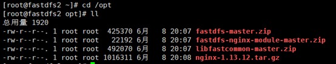
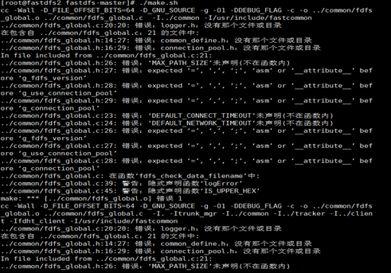
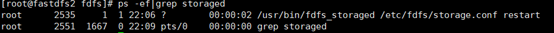
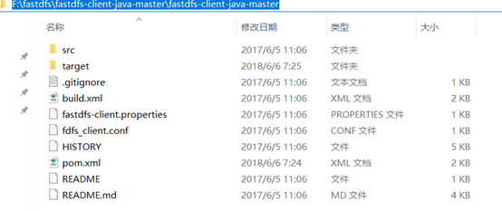
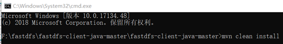
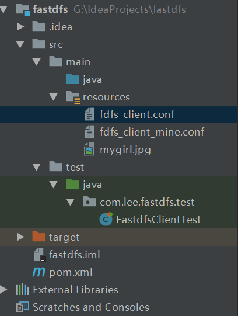
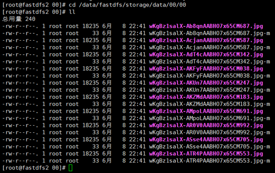

## 前言

目前项目是tomcat单机部署的，图片、视频也是上传到tomcat目录下，关键是此项目的主要内容还就是针对图片、视频的，这让我非常担忧；文件服务器的应用是必然的，而且时间还不会太久。之前一直有听说fastdfs，但一直没去认真琢磨他，最近才开始去研究它，今天只是去搭建一个简单的单机版，集群版后续再出；至于架构、原理什么我就不写了，网上资料非常多。

## 环境准备

系统：Centos6.7

fastdfs：到<https://github.com/happyfish100>下载，都下载最新的：fastdfs-
master、libfastcommon-master、fastdfs-nginx-module-master，避免版本问题

Linux终端工具：xshell、xftp

Linux ip：192.168.1.207

## fastdfs安装

上传相关包到/opt下，如图

###  安装zip、unzip

[root@fastdfs2 opt]# yum install -y unzip zip

###  解压fastdfs-master.zip

[root@fastdfs2 opt]# unzip -o fastdfs-master.zip -d /usr/local

###  编译安装fast

[root@fastdfs2 opt]# cd /usr/local/fastdfs-master

[root@fastdfs2 fastdfs-master]# ./make.sh

报错：./make.sh: line 146: perl: command not found

###  安装perl

[root@fastdfs2 fastdfs-master]# yum -y install perl

再运行./make.sh，报错：make: cc：命令未找到

###  安装gcc

[root@fastdfs2 fastdfs-master]# yum install gcc-c++

再运行./make.sh，仍出现如下错误：

缺少libfastcommon中的相关基础库

###  安装libfastcommon

解压libfastcommon-master.zip

[root@fastdfs2 fastdfs-master]# cd /opt

[root@fastdfs2 opt]# unzip -o libfastcommon-master.zip -d /usr/local

安装libfastcommon

[root@fastdfs2 opt]# cd /usr/local/libfastcommon-master/

[root@fastdfs2 libfastcommon-master]# ./make.sh

[root@fastdfs2 libfastcommon-master]# ./make.sh install

###  再装fastdfs

[root@fastdfs2 local]# cd /usr/local/fastdfs-master/

[root@fastdfs2 fastdfs-master]# ./make.sh

[root@fastdfs2 fastdfs-master]# ./make.sh install

###  拷贝配置文件

将fastdfs安装目录下的conf下的文件拷贝到/etc/fdfs/下

[root@fastdfs2 fastdfs-master]# cp -r conf/* /etc/fdfs/

自此fastdfs安装完成了，接下来配置trackerd和storaged，并启动它们。

###  fdfs可执行命令

[root@fastdfs2 fdfs]# ll /usr/bin/fdfs*

    
    
    -rwxr-xr-x. 1 root root 210899 6月   8 21:00 /usr/bin/fdfs_appender_test
    -rwxr-xr-x. 1 root root 210868 6月   8 21:00 /usr/bin/fdfs_appender_test1
    -rwxr-xr-x. 1 root root 198740 6月   8 21:00 /usr/bin/fdfs_append_file
    -rwxr-xr-x. 1 root root 198044 6月   8 21:00 /usr/bin/fdfs_crc32
    -rwxr-xr-x. 1 root root 198735 6月   8 21:00 /usr/bin/fdfs_delete_file
    -rwxr-xr-x. 1 root root 199112 6月   8 21:00 /usr/bin/fdfs_download_file
    -rwxr-xr-x. 1 root root 198960 6月   8 21:00 /usr/bin/fdfs_file_info
    -rwxr-xr-x. 1 root root 211836 6月   8 21:00 /usr/bin/fdfs_monitor
    -rwxr-xr-x. 1 root root 762687 6月   8 21:00 /usr/bin/fdfs_storaged
    -rwxr-xr-x. 1 root root 212997 6月   8 21:00 /usr/bin/fdfs_test
    -rwxr-xr-x. 1 root root 212618 6月   8 21:00 /usr/bin/fdfs_test1
    -rwxr-xr-x. 1 root root 329821 6月   8 21:00 /usr/bin/fdfs_trackerd
    -rwxr-xr-x. 1 root root 199076 6月   8 21:00 /usr/bin/fdfs_upload_appender
    -rwxr-xr-x. 1 root root 203766 6月   8 21:00 /usr/bin/fdfs_upload_file

View Code

## 配置并启动trackerd

###  修改trackerd.conf

不改也可以，但是要保证/home/yuqing/fastdfs路径存在

[root@fastdfs2 fdfs]# cd /etc/fdfs/

[root@fastdfs2 fdfs]# vi tracker.conf

将base_path=/home/yuqing/fastdfs改成base_path=/data/fastdfs

###  创建trackerd数据、日志目录

[root@fastdfs2 fdfs]# mkdir -p /data/fastdfs

###  启动trackerd

[root@fastdfs2 fdfs]# /usr/bin/fdfs_trackerd /etc/fdfs/tracker.conf restart

查看trackerd进程，如下图：

说明trackered已经启动起来；其实也可以查看日志：/data/fastdfs/logs/trackerd.log，来判断trackerd是否正常启动起来。

## 配置并启动storaged

###  修改storage.conf

[root@fastdfs2 fdfs]# cd /etc/fdfs/

[root@fastdfs2 fdfs]# vi storage.conf

base_path=/home/yuqing/fastdfs改为：base_path=/data/fastdfs

store_path0=/home/yuqing/fastdfs改为：store_path0=/data/fastdfs/storage

tracker_server=192.168.209.121:22122改为：tracker_server=192.168.1.207:22122，这个ip改成自己的

###  创建storaged数据、日志目录

[root@fastdfs2 fdfs]# mkdir -p /data/fastdfs/storage

###  启动storaged

[root@fastdfs2 fdfs]# /usr/bin/fdfs_storaged /etc/fdfs/storage.conf restart

查看storaged进程，如下图：

说明storaged已经启动起来；其实也可以查看日志：/data/fastdfs/logs/storaged.log来判断storaged是否正常启动起来。

## 上传图片测试

###  本地（win环境）安装fastdfs连接驱动

从<https://github.com/happyfish100/fastdfs-client-java>下载源码，我下载的是zip包，解压后目录如下图：

maven本地安装：mvn clean install

当然也可以用ant构建：ant clean package

###  书写测试代码

代码结构如图

fdfs_client_mine.conf：

    
    
    connect_timeout = 2
    network_timeout = 30
    charset = UTF-8
    http.tracker_http_port = 8080
    http.anti_steal_token = no
    http.secret_key = FastDFS1234567890
    
    tracker_server = 192.168.1.207:22122

View Code

FastdfsClientTest.java：

    
    
    package com.lee.fastdfs.test;
    
    import org.csource.common.NameValuePair;
    import org.csource.fastdfs.*;
    import org.junit.Test;
    
    import java.io.FileNotFoundException;
    import java.io.IOException;
    
    public class FastdfsClientTest {
    
        //客户端配置文件
        public String conf_filename = "fdfs_client_mine.conf";
        //本地文件，要上传的文件
        public String local_filename = "G:\\IdeaProjects\\fastdfs\\src\\main\\resources\\mygirl.jpg";
    
        //上传文件
        @Test
        public void testUpload() {
    
            for(int i=0;i<10;i++){
    
                try {
                    ClientGlobal.init(conf_filename);
    
                    TrackerClient tracker = new TrackerClient();
                    TrackerServer trackerServer = tracker.getConnection();
                    StorageServer storageServer = null;
    
                    StorageClient storageClient = new StorageClient(trackerServer,
                            storageServer);
                    NameValuePair nvp [] = new NameValuePair[]{
                            new NameValuePair("item_id", "100010"),
                            new NameValuePair("width", "80"),
                            new NameValuePair("height", "90")
                    };
                    String fileIds[] = storageClient.upload_file(local_filename, null,
                            nvp);
    
                    System.out.println(fileIds.length);
                    System.out.println("组名：" + fileIds[0]);
                    System.out.println("路径: " + fileIds[1]);
    
                } catch (FileNotFoundException e) {
                    e.printStackTrace();
                } catch (IOException e) {
                    e.printStackTrace();
                } catch (Exception e) {
                    e.printStackTrace();
                }
            }
        }
    
    }

View Code

###  上传图片：mygirl.jpg

执行测试代码，当输出如下信息时，表示上传成功：

    
    
    2
    组名：group1
    路径: M00/00/00/wKgBz1salX-AKZMdAABHO7x65CM183.jpg
    2
    组名：group1
    路径: M00/00/00/wKgBz1salX-ATR4PAABHO7x65CM553.jpg
    2
    组名：group1
    路径: M00/00/00/wKgBz1salX-AKFyFAABHO7x65CM038.jpg
    2
    组名：group1
    路径: M00/00/00/wKgBz1salX-ASse4AABHO7x65CM705.jpg
    2
    组名：group1
    路径: M00/00/00/wKgBz1salX-AKUn7AABHO7x65CM247.jpg
    2
    组名：group1
    路径: M00/00/00/wKgBz1salX-AdT4cAABHO7x65CM342.jpg
    2
    组名：group1
    路径: M00/00/00/wKgBz1salX-AR0V0AABHO7x65CM992.jpg
    2
    组名：group1
    路径: M00/00/00/wKgBz1salX-AMpoLAABHO7x65CM691.jpg
    2
    组名：group1
    路径: M00/00/00/wKgBz1salX-AcjanAABHO7x65CM587.jpg
    2
    组名：group1
    路径: M00/00/00/wKgBz1salX-Ab8qnAABHO7x65CM687.jpg

View Code

我们到服务器上看看，图片确实已经上传了，如下图：

由于现在还没有和nginx整合无法使用http下载。

## FastDFS 和nginx整合

###  fastdfs-nginx-module安装

解压

[root@fastdfs2 00]# cd /opt

[root@fastdfs2 opt]# unzip -o fastdfs-nginx-module-master.zip -d /usr/local

拷贝配置文件

[root@fastdfs2 opt]# cd /usr/local/fastdfs-nginx-module-master/src

[root@fastdfs2 src]# cp mod_fastdfs.conf /etc/fdfs/

编辑配置文件

[root@fastdfs2 src]# cd /etc/fdfs/

[root@fastdfs2 fdfs]# vi mod_fastdfs.conf

base_path=/tmp改成：base_path=/data/fastdfs

tracker_server=tracker:22122改成：tracker_server=192.168.1.207:22122

url_have_group_name = false改成：url_have_group_name = true；#url中包含group名称

store_path0=/home/yuqing/fastdfs改成：store_path0=/data/fastdfs/storage

###  nginx安装

nginx依赖包安装

[root@fastdfs2 fdfs]# cd /opt

[root@fastdfs2 opt]# yum -y install zlib zlib-devel openssl openssl--devel
pcre pcre-devel

解压nginx

[root@fastdfs2 opt]# tar -zxvf nginx-1.13.12.tar.gz

安装nginx并添加fastdfs模块

[root@fastdfs2 opt]# cd nginx-1.13.12

[root@fastdfs2 nginx-1.13.12]# ./configure --prefix=/usr/local/nginx --add-
module=/usr/local/fastdfs-nginx-module-master/src

[root@fastdfs2 nginx-1.13.12]# make

[root@fastdfs2 nginx-1.13.12]# make install

检查nginx模块

[root@fastdfs2 nginx-1.13.12]# cd /usr/local/nginx/sbin/

[root@fastdfs2 sbin]# ./nginx -V

    
    
    nginx version: nginx/1.13.12
    uilt by gcc 4.4.7 20120313 (Red Hat 4.4.7-18) (GCC)
    configure arguments: --prefix=/usr/local/nginx --add-module=/usr/local/fastdfs-nginx-module-master/src

已经把fastdfs模块添加进去了。

配置nginx配置文件

[root@fastdfs2 sbin]# cd /usr/local/nginx/conf

[root@fastdfs2 conf]# vi nginx-fdfs.conf

内容如下，ip注意改成自己的：

    
    
    events {
        use epoll;
    
        worker_connections  1024;
    }
    http {
        server {
            listen       80;
            server_name  192.168.1.207;
    
            location /group1/M00/{
                    #root /home/FastDFS/fdfs_storage/data;
                    ngx_fastdfs_module;
            }
        }
        server {
            listen 8888;
        server_name 192.168.1.207;
            location / {
                root   html;
                index  index.html index.htm;
            }
        }
    }

View Code

###  启动nginx

[root@fastdfs2 conf]# cd /usr/local/nginx/sbin/

[root@fastdfs2 sbin]# ./nginx -c /usr/local/nginx/conf/nginx-fdfs.conf

###  访问图片

文件路径在上面的上传图片的测试代码中有输入，我们进行拼装下：

http://192.168.1.207/group1/M00/00/00/wKgBz1salX-ATR4PAABHO7x65CM553.jpg

##  总结

1、fastdfs相关包推荐直接到官网下载，能避免因为版本而造成的问题

2、上传成功而访问却出现nginx：400问题，极有可能url_have_group_name =
false没有改成：url_have_group_name = true；

大家搭建的时候一定要细心再细心，也祝大家能够顺利的完成！（我是搭建了一段时间，中间各种小插曲）

