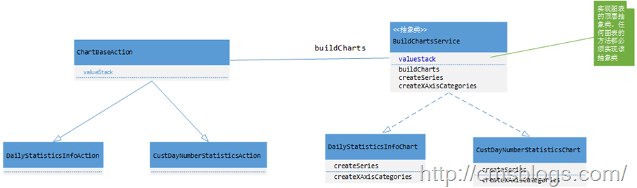

Highcharts 是一个用纯JavaScript编写的一个图表库，
能够很简单便捷的在web网站或是web应用程序添加有交互性的图表。支持的图表类型有曲线图、区域图、柱状图、饼状图、散状点图和综合图表。但是参考[官网](http://www.hcharts.cn/)的实例，我发现如果在项目中频繁使用highchart，按照它的方式还是挺复杂的，我这里所谓的复杂并不是难而是麻烦，因为你每写一个图表你就必须重新写类似于下面结构的javascript代码：

    
    
    $("#container").highcharts({
            title: {
                text: "Monthly Average Temperature",
                x: -20 //center
            },
            subtitle: {
                text: "Source: WorldClimate.com",
                x: -20
            },
            xAxis: {
                categories: ["Jan", "Feb", "Mar", "Apr", "May", "Jun","Jul", "Aug", "Sep", "Oct", "Nov", "Dec"]
            },
            yAxis: {
                title: {
                    text: "Temperature (°C)"
                },
                plotLines: [{
                    value: 0,
                    width: 1,
                    color: "#808080"
                }]
            },
            tooltip: {
                valueSuffix: "°C"
            },
            legend: {
                layout: "vertical",
                align: "right",
                verticalAlign: "middle",
                borderWidth: 0
            },
            series: [{
                name: "Tokyo",
                data: [7.0, 6.9, 9.5, 14.5, 18.2, 21.5, 25.2, 26.5, 23.3, 18.3, 13.9, 9.6]
            }, {
                name: "New York",
                data: [-0.2, 0.8, 5.7, 11.3, 17.0, 22.0, 24.8, 24.1, 20.1, 14.1, 8.6, 2.5]
            }, {
                name: "Berlin",
                data: [-0.9, 0.6, 3.5, 8.4, 13.5, 17.0, 18.6, 17.9, 14.3, 9.0, 3.9, 1.0]
            }, {
                name: "London",
                data: [3.9, 4.2, 5.7, 8.5, 11.9, 15.2, 17.0, 16.6, 14.2, 10.3, 6.6, 4.8]
            }]
        });

所以如果在项目中使用必定是非常繁琐的，很有必要对highchart进一步封装。封装说的简单点就是找出共通点。多看几个highchart的图表源码就会发现，他们无非就是这么几个：标题（title、subTitle）、X轴（xAxis）、Y轴（yAxis）、图例（legend）、数据点选项（plotOptions）、数据项（series），所以我们只需要对这些个元素进行处理即可。首先先看看我封装的结果：

    
    
    var jhc = new $.jHighChart({
                    renderTo: $("#numberCardChart"),
                    chart:{chartBgColor:"#FBFCFD"},
                    chartType: "column",
                    title: "商户会员统计",
                    subtitle: "2014-2015会员统计",
                    xAxisName: "时间",
                    xCategories:responseData.categories,
                    yAxisSetting: [{ key: "numbers",name:"会员数" ,oppositeOption: false}],
                    yAxisColumn: [{ key: "numbers",name:"会员数"}],
                    series: responseData.series,
                    legend:{"enabled":false},
                    click: function (params) {
                        queryNumberDetail(params);
                    }
            });
        jhc.create();

renderTo为展示的DIV ID，chart为图表的设置、chartType图表的展示类型、title主标题、subtitle副标题、xAxisName
X轴名称、xCategoriesX轴数据、yAxisSetting Y轴设置、series数据项。

整个highchart的配置option如下：

    
    
    var options = $.extend({
              //背景颜色
                  chart:{chartBgColor:"#FFFFFF",width:"",height:""},
                  //需要展示的位置（哪个DOM元素内）
                  renderTo: $(document.body),
                  //图表类型：bar,line,spline,column,pie,area,areaspline,combine,bubble,scatter
                  chartType: "",
                  //图表大标题
                  title: "",
                  //图表小标题
                  subtitle: "",
                  //X轴名称
                  xAxisName: "",
                  //X轴列表数据，是一个JSON的LIST对象
                  xCategories:{},
                  //Y轴设置，可添加多条Y轴， key-Y轴名称，oppositeOption-true/false（true为right, false为left）
                  yAxisSetting: [{ key: "",name:"" ,oppositeOption: false}],
                  //key-Y轴对应数据，nane-名称，chartType-图形类型，yIndex-每个指标集需要对应的具体Y轴索引
                  yAxisColumn: [{ key: "",name:"",chartType: "", yIndex: 0, color: null}],
                  //图表数据源，是一个JSON的LIST对象
                  series: {},
                  //Point MouseOver事件
                  mouseOver: function () { },
                  //Point mouseOut事件
                  mouseOut: function () { },
                  //Point click事件:出发下钻方法
                  click: function () { },
                  //是否开启导出按钮
                  exportButton: true,
                  //图标容器大小
                  containerSize:{width:null,height:null},
                  //图例选项:默认不显示：具体的配置请参看API
                  legend:{enabled:false,layout:"",align:"",verticalAlign:"",floating:false,x:"",y:"",backgroundColor:"#FFFFFF"},
                  //数据点选项
                  //showInLegend:是否显示饼图图例,dataEnable:是否显示饼图数据点
                  plotOptions:{showInLegend:false,dataEnable:false},
                  //基本参数设置：主要用于设置图表高度、宽度
                  chart:{width:"",height:""}
    
              }, setting);

上面是对javascript部分进行处理，封装。但是我们的数据时通过后台来的，怎么才能将后台数据封装到该插件中去呢？可能心细的博友发现了，在上面的使用方法中注意到了这两个地方：xCategories:responseData.categories、series:
responseData.series,responseData为后台的返回数据，categories为X轴数据，series为数据项。在后台我是这样处理的：

上面UML是实现后台数据的结构图、其中BuildChartsService为顶层抽象类，向外暴露buildCharts方法，实现图表的子类需要实现createXAxisCategories、createSeries两个方法。ChartBaseAction为构建图表的基础Action，通过Ajax请求，它的主要功能是提供基本的统计数据valueStack，并对数据项进行封装处理。SeriesChartVO、SeriesDatasVO两个类为图表统计数据项的支撑类，其中SeriesChartVO为统计图表数据选项VO，一个seriesChartVO对应一条记录，jHightChart内部实现使用yAxisColumn的key与seriesChartVO的kye进行一一对应。SeriesDatasVO为统计图表数，统计内部数据表现形式为:data:[{name:"",y:"",drilldown:"",params:""}]，该类主要是用户数据项的构建和配置，例如配置下钻数据参数等等。

### 实例

请求Action继承构建图表ChartBaseAction：

    
    
    public class QueryDailyStatisticsInfoAction extends ChartBaseAction{
    
        private static final long serialVersionUID = 6822826781517049491L;
        
        @Resource
        private IHistoryStatisticsDailyTransService historyStatisticsDailyTransService;
    
        @SuppressWarnings("unchecked")
        @Override
        public String execute() throws Exception {
            List<JSON> list = (List<JSON>) getRequest().getSession().getAttribute("dailyList");
            
            valueStack = historyStatisticsDailyTransService.getdailyStatisticsInfo(list);
            
            getRequest().getSession().removeAttribute("dailyList");
            
            return SUCCESS;
        }
    }

该Action通过service的getdailyStatisticsInfo方法来获取数据，然后构建基本的图表数据参数Map

    
    
    private Map<String, Object> buildDailyStatisticsInfo(List<String> categories,
                List<JSON> list) throws ServiceException{
            Map<String, Object> categoriesMap = new HashMap<String, Object>();
            categoriesMap.put("list", categories);
            
            Map<String, Object> seriesMap = new HashMap<String, Object>();
            seriesMap.put("seriesList", list);
            
            Map<String, Object> contentMap = new HashMap<String, Object>();
            //X轴数据项
            contentMap.put("categories", categoriesMap);
            //数据项
            contentMap.put("series", seriesMap);
            
            BuildChartsService service = new DailyStatisticsInfoChart();
            return service.buildCharts(contentMap);
        }

最后使用DailyStatisticsInfoChart的buildChart方法来实现图表数据构建

    
    
    public class DailyStatisticsInfoChart extends BuildChartsService{
    
        @SuppressWarnings("unchecked")
        protected List<String> createXAxisCategories(Map<String,Object> xAxisMap) {
            List<String> categories = (List<String>) xAxisMap.get("list");
            return categories;
        }
    
        @Override
        @SuppressWarnings("unchecked")
        protected List<SeriesChartVO> createSeries(Map<String,Object> contentMap)
                throws ServiceException {
            List<JSON> jsons = (List<JSON>) contentMap.get("seriesList");
            
            List<SeriesDatasVO> dataList = new ArrayList<SeriesDatasVO>();
            SeriesDatasVO datas = null;
            for(int i = 0 ; i < jsons.size() ; i++){
                JSONObject json = JSONObject.fromObject(jsons.get(i));
                String name = (String) json.get("payType");
                Object y = json.get("amt");
                
                datas = new SeriesDatasVO(name, y);
                dataList.add(datas);
            }
            
            SeriesChartVO chartVO = new SeriesChartVO("dailyStatistics", dataList);
            List<SeriesChartVO> chartList = new ArrayList<SeriesChartVO>();
            chartList.add(chartVO);
            
            return chartList;
        }
    }

构建完数据后，最后一步就是使用jHighchart来实现图表了：

    
    
    jhc = new $.jHighChart({
                    renderTo: $("#chartDIV"),
                    chartType: "pie",
                    title: "商户日结算统计",
                    xAxisName: "",
                    xCategories:responseData.categories,
                    yAxisSetting: [{ key: "dailyStatistics",name:"交易额" ,oppositeOption: false}],
                    yAxisColumn: [{ key: "dailyStatistics",name:"总额"}],
                    series: responseData.series,
                    legend:{"enabled":false},
                    plotOptions:{"dataEnable":true},
                    click: function (params) {
                        queryDetail(params);
                    }
            });
        jhc.create();

### demo下载

[chart.rar](http://pan.baidu.com/s/1dDmzhN7)

* * *

**\-----原文出自:<http://cmsblogs.com/?p=1537>**[
****](http://cmsblogs.com/?p=1201) **,请尊重作者辛勤劳动成果,转载说明出处.**

**\-----个人站点:**[ **http://cmsblogs.com**](http://cmsblogs.com/)

