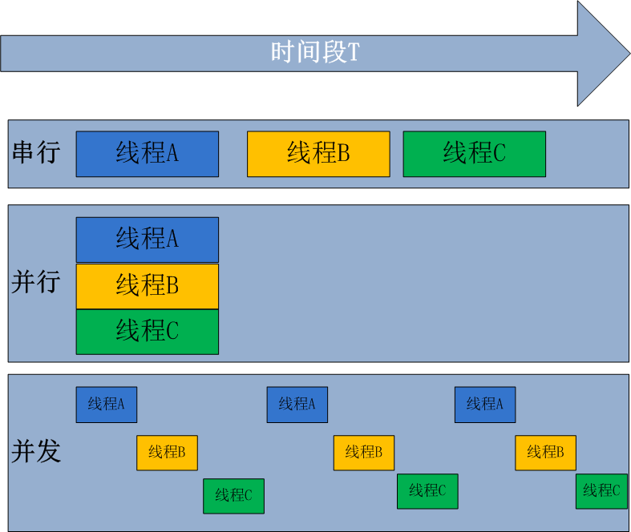
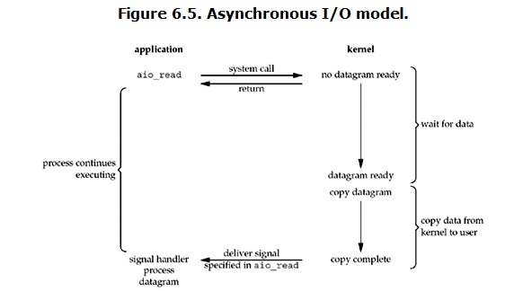

# 一 进程与线程的概念

## 1.1 进程

考虑一个场景：浏览器，网易云音乐以及notepad++
三个软件只能顺序执行是怎样一种场景呢？另外，假如有两个程序A和B，程序A在执行到一半的过程中，需要读取大量的数据输入（I/O操作），而此时CPU只能静静地等待任务A读取完数据才能继续执行，这样就白白浪费了CPU资源。你是不是已经想到在程序A读取数据的过程中，让程序B去执行，当程序A读取完数据之后，让程序B暂停。聪明，这当然没问题，但这里有一个关键词：切换。

既然是切换，那么这就涉及到了状态的保存，状态的恢复，加上程序A与程序B所需要的系统资源（内存，硬盘，键盘等等）是不一样的。自然而然的就需要有一个东西去记录程序A和程序B分别需要什么资源，怎样去识别程序A和程序B等等(比如读书)。

进程定义：

进程就是一个程序在一个数据集上的一次动态执行过程。进程一般由程序、数据集、进程控制块三部分组成。我们编写的程序用来描述进程要完成哪些功能以及如何完成；数据集则是程序在执行过程中所需要使用的资源；进程控制块用来记录进程的外部特征，描述进程的执行变化过程，系统可以利用它来控制和管理进程，它是系统感知进程存在的唯一标志。

举一例说明进程：  
想象一位有一手好厨艺的计算机科学家正在为他的女儿烘制生日蛋糕。他有做生日蛋糕的食谱，厨房里有所需的原料:面粉、鸡蛋、糖、香草汁等。在这个比喻中，做蛋糕的食谱就是程序(即用适当形式描述的算法)计算机科学家就是处理器(cpu)，而做蛋糕的各种原料就是输入数据。进程就是厨师阅读食谱、取来各种原料以及烘制蛋糕等一系列动作的总和。现在假设计算机科学家的儿子哭着跑了进来，说他的头被一只蜜蜂蛰了。计算机科学家就记录下他照着食谱做到哪儿了(保存进程的当前状态)，然后拿出一本急救手册，按照其中的指示处理蛰伤。这里，我们看到处理机从一个进程(做蛋糕)切换到另一个高优先级的进程(实施医疗救治)，每个进程拥有各自的程序(食谱和急救手册)。当蜜蜂蛰伤处理完之后，这位计算机科学家又回来做蛋糕，从他离开时的那一步继续做下去。

## 1.2 线程

线程的出现是为了降低上下文切换的消耗，提高系统的并发性，并突破一个进程只能干一样事的缺陷，使到进程内并发成为可能。

假设，一个文本程序，需要接受键盘输入，将内容显示在屏幕上，还需要保存信息到硬盘中。若只有一个进程，势必造成同一时间只能干一样事的尴尬（当保存时，就不能通过键盘输入内容）。若有多个进程，每个进程负责一个任务，进程A负责接收键盘输入的任务，进程B负责将内容显示在屏幕上的任务，进程C负责保存内容到硬盘中的任务。这里进程A，B，C间的协作涉及到了进程通信问题，而且有共同都需要拥有的东西——-文本内容，不停的切换造成性能上的损失。若有一种机制，可以使任务A，B，C共享资源，这样上下文切换所需要保存和恢复的内容就少了，同时又可以减少通信所带来的性能损耗，那就好了。是的，这种机制就是线程。  
线程也叫轻量级进程，它是一个基本的CPU执行单元，也是程序执行过程中的最小单元，由线程ID、程序计数器、寄存器集合和堆栈共同组成。线程的引入减小了程序并发执行时的开销，提高了操作系统的并发性能。线程没有自己的系统资源。

## 1.3 进程与线程的关系

进程是计算机中的程序关于某数据集合上的一次运行活动，是系统进行资源分配和调度的基本单位，是操作系统结构的基础。或者说进程是具有一定独立功能的程序关于某个数据集合上的一次运行活动,进程是系统进行资源分配和调度的一个独立单位。  
线程则是进程的一个实体,是CPU调度和分派的基本单位,它是比进程更小的能独立运行的基本单位。

进程和线程的关系：

(1)一个线程只能属于一个进程，而一个进程可以有多个线程，但至少有一个线程。  
(2)资源分配给进程，同一进程的所有线程共享该进程的所有资源。  
(3)CPU分给线程，即真正在CPU上运行的是线程。

## 1.4 并行和并发

并行处理（Parallel
Processing）是计算机系统中能同时执行两个或更多个处理的一种计算方法。并行处理可同时工作于同一程序的不同方面。并行处理的主要目的是节省大型和复杂问题的解决时间。并发处理(concurrency
Processing)：指一个时间段中有几个程序都处于已启动运行到运行完毕之间，且这几个程序都是在同一个处理机(CPU)上运行，但任一个时刻点上只有一个程序在处理机(CPU)上运行

并发的关键是你有处理多个任务的能力，不一定要同时。并行的关键是你有同时处理多个任务的能力。所以说，并行是并发的子集

## 1.5 同步与异步

在计算机领域，同步就是指一个进程在执行某个请求的时候，若该请求需要一段时间才能返回信息，那么这个进程将会一直等待下去，直到收到返回信息才继续执行下去；异步是指进程不需要一直等下去，而是继续执行下面的操作，不管其他进程的状态。当有消息返回时系统会通知进程进行处理，这样可以提高执行的效率。举个例子，打电话时就是同步通信，发短息时就是异步通信。

[回到顶部](https://www.cnblogs.com/yuanchenqi/articles/6755717.html#_labelTop)

# 二 threading模块

## 2.1 线程对象的创建

### 2.1.1 Thread类直接创建

    
    
    import threading
    import time
    
    def countNum(n): # 定义某个线程要运行的函数
    
        print("running on number:%s" %n)
    
        time.sleep(3)
    
    if __name__ == "__main__":
    
        t1 = threading.Thread(target=countNum,args=(23,)) #生成一个线程实例
        t2 = threading.Thread(target=countNum,args=(34,))
    
        t1.start() #启动线程
        t2.start()
    
        print("ending!")

### 2.1.2 Thread类继承式创建

    
    
    #继承Thread式创建
    
    import threading
    import time
    
    class MyThread(threading.Thread):
    
        def __init__(self,num):
            threading.Thread.__init__(self)
            self.num=num
    
        def run(self):
            print("running on number:%s" %self.num)
            time.sleep(3)
    
    t1=MyThread(56)
    t2=MyThread(78)
    
    t1.start()
    t2.start()
    print("ending")

## 2.2 Thread类的实例方法

### 2.2.1 join()和setDaemon()

    
    
    # join()：在子线程完成运行之前，这个子线程的父线程将一直被阻塞。
    
    # setDaemon(True)：
            """
             将线程声明为守护线程，必须在start() 方法调用之前设置，如果不设置为守护线程程序会被无限挂起。
    
             当我们在程序运行中，执行一个主线程，如果主线程又创建一个子线程，主线程和子线程 就分兵两路，分别运行，那么当主线程完成
    
             想退出时，会检验子线程是否完成。如果子线程未完成，则主线程会等待子线程完成后再退出。但是有时候我们需要的是只要主线程
    
             完成了，不管子线程是否完成，都要和主线程一起退出，这时就可以 用setDaemon方法啦"""
    
    
    import threading
    from time import ctime,sleep
    import time
    
    def Music(name):
    
            print ("Begin listening to {name}. {time}".format(name=name,time=ctime()))
            sleep(3)
            print("end listening {time}".format(time=ctime()))
    
    def Blog(title):
    
            print ("Begin recording the {title}. {time}".format(title=title,time=ctime()))
            sleep(5)
            print("end recording {time}".format(time=ctime()))
    
    
    threads = []
    
    
    t1 = threading.Thread(target=Music,args=("FILL ME",))
    t2 = threading.Thread(target=Blog,args=("",))
    
    threads.append(t1)
    threads.append(t2)
    
    if __name__ == "__main__":
    
        #t2.setDaemon(True)
    
        for t in threads:
    
            #t.setDaemon(True) #注意:一定在start之前设置
            t.start()
    
            #t.join()
    
        #t1.join()
        #t2.join()    #  考虑这三种join位置下的结果？
    
        print ("all over %s" %ctime())

 daemon

###  2.2.2 其它方法

    
    
    Thread实例对象的方法  
      # isAlive(): 返回线程是否活动的。
      # getName(): 返回线程名。
      # setName(): 设置线程名。
    
    threading模块提供的一些方法：
      # threading.currentThread(): 返回当前的线程变量。
      # threading.enumerate(): 返回一个包含正在运行的线程的list。正在运行指线程启动后、结束前，不包括启动前和终止后的线程。
      # threading.activeCount(): 返回正在运行的线程数量，与len(threading.enumerate())有相同的结果。

## 2.3 GIL(全局解释器锁)

    
    
    """  
    
    定义：
    In CPython, the global interpreter lock, or GIL, is a mutex that prevents multiple 
    native threads from executing Python bytecodes at once. This lock is necessary mainly 
    because CPython’s memory management is not thread-safe. (However, since the GIL 
    exists, other features have grown to depend on the guarantees that it enforces.)
    
    """

Python中的线程是操作系统的原生线程，Python虚拟机使用一个全局解释器锁（Global Interpreter
Lock）来互斥线程对Python虚拟机的使用。为了支持多线程机制，一个基本的要求就是需要实现不同线程对共享资源访问的互斥，所以引入了GIL。  
GIL：在一个线程拥有了解释器的访问权之后，其他的所有线程都必须等待它释放解释器的访问权，即使这些线程的下一条指令并不会互相影响。  
在调用任何Python C API之前，要先获得GIL  
GIL缺点：多处理器退化为单处理器；优点：避免大量的加锁解锁操作

### 2.3.1 GIL的早期设计

Python支持多线程，而解决多线程之间数据完整性和状态同步的最简单方法自然就是加锁。
于是有了GIL这把超级大锁，而当越来越多的代码库开发者接受了这种设定后，他们开始大量依赖这种特性（即默认python内部对象是thread-
safe的，无需在实现时考虑额外的内存锁和同步操作）。慢慢的这种实现方式被发现是蛋疼且低效的。但当大家试图去拆分和去除GIL的时候，发现大量库代码开发者已经重度依赖GIL而非常难以去除了。有多难？做个类比，像MySQL这样的“小项目”为了把Buffer
Pool
Mutex这把大锁拆分成各个小锁也花了从5.5到5.6再到5.7多个大版为期近5年的时间，并且仍在继续。MySQL这个背后有公司支持且有固定开发团队的产品走的如此艰难，那又更何况Python这样核心开发和代码贡献者高度社区化的团队呢？

### 2.3.2 GIL的影响

无论你启多少个线程，你有多少个cpu, Python在执行一个进程的时候会淡定的在同一时刻只允许一个线程运行。  
所以，python是无法利用多核CPU实现多线程的。  
这样，python对于计算密集型的任务开多线程的效率甚至不如串行(没有大量切换)，但是，对于IO密集型的任务效率还是有显著提升的。

**计算密集型：**

 View Code

### 2.3.3 解决方案

用multiprocessing替代Thread
multiprocessing库的出现很大程度上是为了弥补thread库因为GIL而低效的缺陷。它完整的复制了一套thread所提供的接口方便迁移。唯一的不同就是它使用了多进程而不是多线程。每个进程有自己的独立的GIL，因此也不会出现进程之间的GIL争抢。

 View Code

当然multiprocessing也不是万能良药。它的引入会增加程序实现时线程间数据通讯和同步的困难。就拿计数器来举例子，如果我们要多个线程累加同一个变量，对于thread来说，申明一个global变量，用thread.Lock的context包裹住三行就搞定了。而multiprocessing由于进程之间无法看到对方的数据，只能通过在主线程申明一个Queue，put再get或者用share
memory的方法。这个额外的实现成本使得本来就非常痛苦的多线程程序编码，变得更加痛苦了。

总结：因为GIL的存在，只有IO Bound场景下得多线程会得到较好的性能 -
如果对并行计算性能较高的程序可以考虑把核心部分也成C模块，或者索性用其他语言实现 - GIL在较长一段时间内将会继续存在，但是会不断对其进行改进。

**所以对于GIL，既然不能反抗，那就学会去享受它吧！**

## 2.4 同步锁 (Lock)

    
    
    import time
    import threading
    
    def addNum():
        global num #在每个线程中都获取这个全局变量
        #num-=1
    
        temp=num
        time.sleep(0.1)
        num =temp-1  # 对此公共变量进行-1操作
    
    num = 100  #设定一个共享变量
    
    thread_list = []
    
    for i in range(100):
        t = threading.Thread(target=addNum)
        t.start()
        thread_list.append(t)
    
    for t in thread_list: #等待所有线程执行完毕
        t.join()
    
    print("Result: ", num)

锁通常被用来实现对共享资源的同步访问。为每一个共享资源创建一个Lock对象，当你需要访问该资源时，调用acquire方法来获取锁对象（如果其它线程已经获得了该锁，则当前线程需等待其被释放），待资源访问完后，再调用release方法释放锁：

    
    
    import threading
    
    R=threading.Lock()
    
    R.acquire()
    """
    对公共数据的操作
    """
    R.release()

扩展思考

 View Code

## 2.5 死锁与递归锁

所谓死锁：
是指两个或两个以上的进程或线程在执行过程中，因争夺资源而造成的一种互相等待的现象，若无外力作用，它们都将无法推进下去。此时称系统处于死锁状态或系统产生了死锁，这些永远在互相等待的进程称为死锁进程。

    
    
    import threading
    import time
    
    mutexA = threading.Lock()
    mutexB = threading.Lock()
    
    class MyThread(threading.Thread):
    
        def __init__(self):
            threading.Thread.__init__(self)
    
        def run(self):
            self.fun1()
            self.fun2()
    
        def fun1(self):
    
            mutexA.acquire()  # 如果锁被占用,则阻塞在这里,等待锁的释放
    
            print ("I am %s , get res: %s---%s" %(self.name, "ResA",time.time()))
    
            mutexB.acquire()
            print ("I am %s , get res: %s---%s" %(self.name, "ResB",time.time()))
            mutexB.release()
            mutexA.release()
    
    
        def fun2(self):
    
            mutexB.acquire()
            print ("I am %s , get res: %s---%s" %(self.name, "ResB",time.time()))
            time.sleep(0.2)
    
            mutexA.acquire()
            print ("I am %s , get res: %s---%s" %(self.name, "ResA",time.time()))
            mutexA.release()
    
            mutexB.release()
    
    if __name__ == "__main__":
    
        print("start---------------------------%s"%time.time())
    
        for i in range(0, 10):
            my_thread = MyThread()
            my_thread.start()

在Python中为了支持在同一线程中多次请求同一资源，python提供了可重入锁RLock。这个RLock内部维护着一个Lock和一个counter变量，counter记录了acquire的次数，从而使得资源可以被多次require。直到一个线程所有的acquire都被release，其他的线程才能获得资源。上面的例子如果使用RLock代替Lock，则不会发生死锁：  
  
<table>  
<tr>  
<td>

1

</td>  
<td>

`mutex ``=` `threading.RLock()`

</td> </tr> </table>

## 2.6 Event对象

线程的一个关键特性是每个线程都是独立运行且状态不可预测。如果程序中的其 他线程需要通过判断某个线程的状态来确定自己下一步的操作,这时线程同步问题就
会变得非常棘手。为了解决这些问题,我们需要使用threading库中的Event对象。 对象包含一个可由线程设置的信号标志,它允许线程等待某些事件的发生。在
初始情况下,Event对象中的信号标志被设置为假。如果有线程等待一个Event对象,
而这个Event对象的标志为假,那么这个线程将会被一直阻塞直至该标志为真。一个线程如果将一个Event对象的信号标志设置为真,它将唤醒所有等待这个Event对象的线程。如果一个线程等待一个已经被设置为真的Event对象,那么它将忽略这个事件,
继续执行

    
    
    event.isSet()：返回event的状态值；
    
    event.wait()：如果 event.isSet()==False将阻塞线程；
    
    event.set()： 设置event的状态值为True，所有阻塞池的线程激活进入就绪状态， 等待操作系统调度；
    
    event.clear()：恢复event的状态值为False。

可以考虑一种应用场景（仅仅作为说明），例如，我们有多个线程从Redis队列中读取数据来处理，这些线程都要尝试去连接Redis的服务，一般情况下，如果Redis连接不成功，在各个线程的代码中，都会去尝试重新连接。如果我们想要在启动时确保Redis服务正常，才让那些工作线程去连接Redis服务器，那么我们就可以采用threading.Event机制来协调各个工作线程的连接操作：主线程中会去尝试连接Redis服务，如果正常的话，触发事件，各工作线程会尝试连接Redis服务。

    
    
    import threading
    import time
    import logging
    
    logging.basicConfig(level=logging.DEBUG, format="(%(threadName)-10s) %(message)s",)
    
    def worker(event):
        logging.debug("Waiting for redis ready...")
        event.wait()
        logging.debug("redis ready, and connect to redis server and do some work [%s]", time.ctime())
        time.sleep(1)
    
    def main():
        readis_ready = threading.Event()
        t1 = threading.Thread(target=worker, args=(readis_ready,), name="t1")
        t1.start()
    
        t2 = threading.Thread(target=worker, args=(readis_ready,), name="t2")
        t2.start()
    
        logging.debug("first of all, check redis server, make sure it is OK, and then trigger the redis ready event")
        time.sleep(3) # simulate the check progress
        readis_ready.set()
    
    if __name__=="__main__":
        main()

threading.Event的wait方法还接受一个超时参数，默认情况下如果事件一致没有发生，wait方法会一直阻塞下去，而加入这个超时参数之后，如果阻塞时间超过这个参数设定的值之后，wait方法会返回。对应于上面的应用场景，如果Redis服务器一致没有启动，我们希望子线程能够打印一些日志来不断地提醒我们当前没有一个可以连接的Redis服务，我们就可以通过设置这个超时参数来达成这样的目的：

    
    
    def worker(event):
        while not event.is_set():
            logging.debug("Waiting for redis ready...")
            event.wait(2)
        logging.debug("redis ready, and connect to redis server and do some work [%s]", time.ctime())
        time.sleep(1)

这样，我们就可以在等待Redis服务启动的同时，看到工作线程里正在等待的情况。

## 2.7 Semaphore（信号量）

Semaphore管理一个内置的计数器，  
每当调用acquire()时内置计数器-1；  
调用release() 时内置计数器+1；  
计数器不能小于0；当计数器为0时，acquire()将阻塞线程直到其他线程调用release()。

实例：(同时只有5个线程可以获得semaphore,即可以限制最大连接数为5)：

    
    
    import threading
    import time
    
    semaphore = threading.Semaphore(5)
    
    def func():
        if semaphore.acquire():
            print (threading.currentThread().getName() + " get semaphore")
            time.sleep(2)
            semaphore.release()
    
    for i in range(20):
      t1 = threading.Thread(target=func)
      t1.start()

应用：连接池

思考：与Rlock的区别？

## 2.8 队列(queue)

queue is especially useful in threaded programming when information must be
exchanged safely between multiple threads.

### 2.8.1 get与put方法

    
    
    """
    
    创建一个“队列”对象
    
    import Queue
    q = Queue.Queue(maxsize = 10)
    Queue.Queue类即是一个队列的同步实现。队列长度可为无限或者有限。可通过Queue的构造函数的可选参数
    maxsize来设定队列长度。如果maxsize小于1就表示队列长度无限。
    
    将一个值放入队列中
    q.put(10)
    调用队列对象的put()方法在队尾插入一个项目。put()有两个参数，第一个item为必需的，为插入项目的值；
    第二个block为可选参数，默认为
    1。如果队列当前为空且block为1，put()方法就使调用线程暂停,直到空出一个数据单元。如果block为0，
    put方法将引发Full异常。
    
    将一个值从队列中取出
    q.get()
    调用队列对象的get()方法从队头删除并返回一个项目。可选参数为block，默认为True。如果队列为空且
    block为True，get()就使调用线程暂停，直至有项目可用。如果队列为空且block为False，队列将引发Empty异常。
    
    """

### **2.8.2 join与task_done方法**

    
    
    """
    join() 阻塞进程，直到所有任务完成，需要配合另一个方法task_done。
    
        def join(self):
         with self.all_tasks_done:
          while self.unfinished_tasks:
           self.all_tasks_done.wait()
    
    task_done() 表示某个任务完成。每一条get语句后需要一条task_done。
    
    
    import queue
    q = queue.Queue(5)
    q.put(10)
    q.put(20)
    print(q.get())
    q.task_done()
    print(q.get())
    q.task_done()
    
    q.join()
    
    print("ending!")
    """

### 2.8.3 其他常用方法

    
    
    """
    
    此包中的常用方法(q = Queue.Queue()):  
    
    q.qsize() 返回队列的大小
    q.empty() 如果队列为空，返回True,反之False
    q.full() 如果队列满了，返回True,反之False
    q.full 与 maxsize 大小对应
    q.get([block[, timeout]]) 获取队列，timeout等待时间
    q.get_nowait() 相当q.get(False)非阻塞   
     q.put(item) 写入队列，timeout等待时间
    q.put_nowait(item) 相当q.put(item, False)
    q.task_done() 在完成一项工作之后，q.task_done() 函数向任务已经完成的队列发送一个信号
    q.join() 实际上意味着等到队列为空，再执行别的操作
    
    """

### 2.8.4 其他模式

    
    
    """
    
    Python Queue模块有三种队列及构造函数: 
    
    1、Python Queue模块的FIFO队列先进先出。  class queue.Queue(maxsize) 
    2、LIFO类似于堆，即先进后出。           class queue.LifoQueue(maxsize) 
    3、还有一种是优先级队列级别越低越先出来。 class queue.PriorityQueue(maxsize) 
    
    
    import queue
    
    #先进后出
    
    q=queue.LifoQueue()
    
    q.put(34)
    q.put(56)
    q.put(12)
    
    #优先级
    q=queue.PriorityQueue()
    q.put([5,100])
    q.put([7,200])
    q.put([3,"hello"])
    q.put([4,{"name":"alex"}])
    
    while 1:
      data=q.get()
      print(data)
    
    """

### **2.8.5 生产者消费者模型**

在线程世界里，生产者就是生产数据的线程，消费者就是消费数据的线程。在多线程开发当中，如果生产者处理速度很快，而消费者处理速度很慢，那么生产者就必须等待消费者处理完，才能继续生产数据。同样的道理，如果消费者的处理能力大于生产者，那么消费者就必须等待生产者。为了解决这个问题于是引入了生产者和消费者模式。

生产者消费者模式是通过一个容器来解决生产者和消费者的强耦合问题。生产者和消费者彼此之间不直接通讯，而通过阻塞队列来进行通讯，所以生产者生产完数据之后不用等待消费者处理，直接扔给阻塞队列，消费者不找生产者要数据，而是直接从阻塞队列里取，阻塞队列就相当于一个缓冲区，平衡了生产者和消费者的处理能力。

这就像，在餐厅，厨师做好菜，不需要直接和客户交流，而是交给前台，而客户去饭菜也不需要不找厨师，直接去前台领取即可，这也是一个结耦的过程。

    
    
    import time,random
    import queue,threading
    
    q = queue.Queue()
    
    def Producer(name):
      count = 0
      while count <10:
        print("making........")
        time.sleep(random.randrange(3))
        q.put(count)
        print("Producer %s has produced %s baozi.." %(name, count))
        count +=1
        #q.task_done()
        #q.join()
        print("ok......")
    def Consumer(name):
      count = 0
      while count <10:
        time.sleep(random.randrange(4))
        if not q.empty():
            data = q.get()
            #q.task_done()
            #q.join()
            print(data)
            print("\033[32;1mConsumer %s has eat %s baozi...\033[0m" %(name, data))
        else:
            print("-----no baozi anymore----")
        count +=1
    
    p1 = threading.Thread(target=Producer, args=("A",))
    c1 = threading.Thread(target=Consumer, args=("B",))
    # c2 = threading.Thread(target=Consumer, args=("C",))
    # c3 = threading.Thread(target=Consumer, args=("D",))
    p1.start()
    c1.start()
    # c2.start()
    # c3.start()

[回到顶部](https://www.cnblogs.com/yuanchenqi/articles/6755717.html#_labelTop)

# 三 multiprocessing模块

Multiprocessing is a package that supports spawning processes using an API
similar to the threading module. The multiprocessing package offers both local
and remote concurrency,effectively side-stepping the Global Interpreter Lock
by using subprocesses instead of threads. Due to this, the multiprocessing
module allows the programmer to fully leverage multiple processors on a given
machine. It runs on both Unix and Windows.

由于GIL的存在，python中的多线程其实并不是真正的多线程，如果想要充分地使用多核CPU的资源，在python中大部分情况需要使用多进程。

multiprocessing包是Python中的多进程管理包。与threading.Thread类似，它可以利用multiprocessing.Process对象来创建一个进程。该进程可以运行在Python程序内部编写的函数。该Process对象与Thread对象的用法相同，也有start(),
run(), join()的方法。此外multiprocessing包中也有Lock/Event/Semaphore/Condition类
(这些对象可以像多线程那样，通过参数传递给各个进程)，用以同步进程，其用法与threading包中的同名类一致。所以，multiprocessing的很大一部份与threading使用同一套API，只不过换到了多进程的情境。

## 3.1 python的进程调用

    
    
    # Process类调用
    
    from multiprocessing import Process
    import time
    def f(name):
    
        print("hello", name,time.ctime())
        time.sleep(1)
    
    if __name__ == "__main__":
        p_list=[]
        for i in range(3):
            p = Process(target=f, args=("alvin:%s"%i,))
            p_list.append(p)
            p.start()
        for i in p_list:
            p.join()
        print("end")
    
    # 继承Process类调用
    from multiprocessing import Process
    import time
    
    class MyProcess(Process):
        def __init__(self):
            super(MyProcess, self).__init__()
            # self.name = name
    
        def run(self):
    
            print ("hello", self.name,time.ctime())
            time.sleep(1)
    
    
    if __name__ == "__main__":
        p_list=[]
        for i in range(3):
            p = MyProcess()
            p.start()
            p_list.append(p)
    
        for p in p_list:
            p.join()
    
        print("end")

## 3.2 process类

**构造方法：**

Process([group [, target [, name [, args [, kwargs]]]]])

group: 线程组，目前还没有实现，库引用中提示必须是None；  
target: 要执行的方法；  
name: 进程名；  
args/kwargs: 要传入方法的参数。

**实例方法：**

is_alive()：返回进程是否在运行。

join([timeout])：阻塞当前上下文环境的进程程，直到调用此方法的进程终止或到达指定的timeout（可选参数）。

start()：进程准备就绪，等待CPU调度

run()：strat()调用run方法，如果实例进程时未制定传入target，这star执行t默认run()方法。

terminate()：不管任务是否完成，立即停止工作进程

**属性：**

daemon：和线程的setDeamon功能一样

name：进程名字。

pid：进程号。

    
    
    from multiprocessing import Process
    import os
    import time
    def info(name):
    
    
        print("name:",name)
        print("parent process:", os.getppid())
        print("process id:", os.getpid())
        print("------------------")
        time.sleep(1)
    
    def foo(name):
    
        info(name)
    
    if __name__ == "__main__":
    
        info("main process line")
    
    
        p1 = Process(target=info, args=("alvin",))
        p2 = Process(target=foo, args=("egon",))
        p1.start()
        p2.start()
    
        p1.join()
        p2.join()
    
        print("ending")

通过tasklist(Win)或者ps -elf |grep(linux)命令检测每一个进程号(PID)对应的进程名

## 3.3 进程间通讯

### **3.3.1 进程对列Queue**

    
    
    from multiprocessing import Process, Queue
    import queue
    
    def f(q,n):
        #q.put([123, 456, "hello"])
        q.put(n*n+1)
        print("son process",id(q))
    
    if __name__ == "__main__":
        q = Queue()  #try: q=queue.Queue()
        print("main process",id(q))
    
        for i in range(3):
            p = Process(target=f, args=(q,i))
            p.start()
    
        print(q.get())
        print(q.get())
        print(q.get())

### **3.3.2 管道(pipe)**

The` Pipe()` function returns a pair of connection objects connected by a pipe
which by default is duplex (two-way). For example:

    
    
    from multiprocessing import Process, Pipe
    
    def f(conn):
        conn.send([12, {"name":"yuan"}, "hello"])
        response=conn.recv()
        print("response",response)
        conn.close()
        if __name__ == "__main__":
    
        parent_conn, child_conn = Pipe()
       
        p = Process(target=f, args=(child_conn,))
        p.start()
        print(parent_conn.recv())   # prints "[42, None, "hello"]"
        parent_conn.send("儿子你好!")
        p.join()

Pipe（）返回的两个连接对象代表管道的两端。 每个连接对象都有send()和recv()方法（等等）。
请注意，如果两个进程（或线程）尝试同时读取或写入管道的同一端，管道中的数据可能会损坏。

### 3.3.3 manager

Queue和pipe只是实现了数据交互，并没实现数据共享，即一个进程去更改另一个进程的数据 **。**

A manager object returned by `Manager()` controls a server process which holds
Python objects and allows other processes to manipulate them using proxies.

    
    
    from multiprocessing import Process, Manager
    
    def f(d, l,n):
    
        d[n] = n
        d["name"] ="alvin"
        l.append(n)
    
        #print("l",l)
    
    if __name__ == "__main__":
    
        with Manager() as manager:
    
            d = manager.dict()
    
            l = manager.list(range(5))
            p_list = []
    
            for i in range(10):
                p = Process(target=f, args=(d,l,i))
                p.start()
                p_list.append(p)
    
            for res in p_list:
                res.join()
    
            print(d)
            print(l)

## 3.4 进程池

进程池内部维护一个进程序列，当使用时，则去进程池中获取一个进程，如果进程池序列中没有可供使用的进进程，那么程序就会等待，直到进程池中有可用进程为止。

    
    
    from multiprocessing import Pool
    import time
    
    def foo(args):
     time.sleep(1)
     print(args)
    
    if __name__ == "__main__":
     p = Pool(5)
     for i in range(30):
         p.apply_async(func=foo, args= (i,))
    
     p.close()   # 等子进程执行完毕后关闭线程池
     # time.sleep(2)
     # p.terminate()  # 立刻关闭线程池
     p.join()

进程池内部维护一个进程序列，当使用时，去进程池中获取一个进程，如果进程池序列中没有可供使用的进程，那么程序就会等待，直到进程池中有可用进程为止。

进程池中有以下几个主要方法：

  1. apply：从进程池里取一个进程并执行
  2. apply_async：apply的异步版本
  3. terminate:立刻关闭线程池
  4. join：主进程等待所有子进程执行完毕，必须在close或terminate之后
  5. close：等待所有进程结束后，才关闭线程池

[回到顶部](https://www.cnblogs.com/yuanchenqi/articles/6755717.html#_labelTop)

# 四 协程

协程，又称微线程，纤程。英文名Coroutine。一句话说明什么是线程：协程是一种用户态的轻量级线程。

协程拥有自己的寄存器上下文和栈。协程调度切换时，将寄存器上下文和栈保存到其他地方，在切回来的时候，恢复先前保存的寄存器上下文和栈。因此：

协程能保留上一次调用时的状态（即所有局部状态的一个特定组合），每次过程重入时，就相当于进入上一次调用的状态，换种说法：进入上一次离开时所处逻辑流的位置。

## 4.1 yield与协程

    
    
    import time
    
    """
    传统的生产者-消费者模型是一个线程写消息，一个线程取消息，通过锁机制控制队列和等待，但一不小心就可能死锁。
    如果改用协程，生产者生产消息后，直接通过yield跳转到消费者开始执行，待消费者执行完毕后，切换回生产者继续生产，效率极高。
    """
    # 注意到consumer函数是一个generator（生成器）:
    # 任何包含yield关键字的函数都会自动成为生成器(generator)对象
    
    def consumer():
        r = ""
        while True:
            # 3、consumer通过yield拿到消息，处理，又通过yield把结果传回；
            #    yield指令具有return关键字的作用。然后函数的堆栈会自动冻结(freeze)在这一行。
            #    当函数调用者的下一次利用next()或generator.send()或for-in来再次调用该函数时，
            #    就会从yield代码的下一行开始，继续执行，再返回下一次迭代结果。通过这种方式，迭代器可以实现无限序列和惰性求值。
            n = yield r
            if not n:
                return
            print("[CONSUMER] ←← Consuming %s..." % n)
            time.sleep(1)
            r = "200 OK"
    def produce(c):
        # 1、首先调用c.next()启动生成器
        next(c)
        n = 0
        while n < 5:
            n = n + 1
            print("[PRODUCER] →→ Producing %s..." % n)
            # 2、然后，一旦生产了东西，通过c.send(n)切换到consumer执行；
            cr = c.send(n)
            # 4、produce拿到consumer处理的结果，继续生产下一条消息；
            print("[PRODUCER] Consumer return: %s" % cr)
        # 5、produce决定不生产了，通过c.close()关闭consumer，整个过程结束。
        c.close()
    if __name__=="__main__":
        # 6、整个流程无锁，由一个线程执行，produce和consumer协作完成任务，所以称为“协程”，而非线程的抢占式多任务。
        c = consumer()
        produce(c)
        
        
    """
    result:
    
    [PRODUCER] →→ Producing 1...
    [CONSUMER] ←← Consuming 1...
    [PRODUCER] Consumer return: 200 OK
    [PRODUCER] →→ Producing 2...
    [CONSUMER] ←← Consuming 2...
    [PRODUCER] Consumer return: 200 OK
    [PRODUCER] →→ Producing 3...
    [CONSUMER] ←← Consuming 3...
    [PRODUCER] Consumer return: 200 OK
    [PRODUCER] →→ Producing 4...
    [CONSUMER] ←← Consuming 4...
    [PRODUCER] Consumer return: 200 OK
    [PRODUCER] →→ Producing 5...
    [CONSUMER] ←← Consuming 5...
    [PRODUCER] Consumer return: 200 OK
    """

## 4.2 greenlet

greenlet机制的主要思想是：生成器函数或者协程函数中的yield语句挂起函数的执行，直到稍后使用next()或send()操作进行恢复为止。可以使用一个调度器循环在一组生成器函数之间协作多个任务。greentlet是python中实现我们所谓的"Coroutine(协程)"的一个基础库.

    
    
    from greenlet import greenlet
     
    def test1():
        print (12)
        gr2.switch()
        print (34)
        gr2.switch()
     
    def test2():
        print (56)
        gr1.switch()
        print (78)
     
    gr1 = greenlet(test1)
    gr2 = greenlet(test2)
    gr1.switch()

## **4.2 基于greenlet的框架**

### 4.2.1 gevent模块实现协程

Python通过yield提供了对协程的基本支持，但是不完全。而第三方的gevent为Python提供了比较完善的协程支持。

gevent是第三方库，通过greenlet实现协程，其基本思想是：

当一个greenlet遇到IO操作时，比如访问网络，就自动切换到其他的greenlet，等到IO操作完成，再在适当的时候切换回来继续执行。由于IO操作非常耗时，经常使程序处于等待状态，有了gevent为我们自动切换协程，就保证总有greenlet在运行，而不是等待IO。

由于切换是在IO操作时自动完成，所以gevent需要修改Python自带的一些标准库，这一过程在启动时通过monkey patch完成：

    
    
    import gevent
    import time
    
    def foo():
        print("running in foo")
        gevent.sleep(2)
        print("switch to foo again")
    
    def bar():
        print("switch to bar")
        gevent.sleep(5)
        print("switch to bar again")
    
    start=time.time()
    
    gevent.joinall(
        [gevent.spawn(foo),
        gevent.spawn(bar)]
    )
    
    print(time.time()-start)

当然，实际代码里，我们不会用gevent.sleep()去切换协程，而是在执行到IO操作时，gevent自动切换，代码如下：

    
    
    from gevent import monkey  
    monkey.patch_all()
    import gevent
    from urllib import request
    import time
    
    def f(url):
        print("GET: %s" % url)
        resp = request.urlopen(url)
        data = resp.read()
        print("%d bytes received from %s." % (len(data), url))
    
    start=time.time()
    
    gevent.joinall([
            gevent.spawn(f, "https://itk.org/"),
            gevent.spawn(f, "https://www.github.com/"),
            gevent.spawn(f, "https://zhihu.com/"),
    ])
    
    # f("https://itk.org/")
    # f("https://www.github.com/")
    # f("https://zhihu.com/")
    
    print(time.time()-start)

扩展

 View Code

### eventlet实现协程(了解)

eventlet 是基于 greenlet 实现的面向网络应用的并发处理框架，提供“线程”池、队列等与其他 Python 线程、进程模型非常相似的
api，并且提供了对 Python 发行版自带库及其他模块的超轻量并发适应性调整方法，比直接使用 greenlet 要方便得多。

其基本原理是调整 Python 的 socket 调用，当发生阻塞时则切换到其他 greenlet 执行，这样来保证资源的有效利用。需要注意的是：  
eventlet 提供的函数只能对 Python 代码中的 socket 调用进行处理，而不能对模块的 C 语言部分的 socket
调用进行修改。对后者这类模块，仍然需要把调用模块的代码封装在 Python 标准线程调用中，之后利用 eventlet 提供的适配器实现 eventlet
与标准线程之间的协作。  
虽然 eventlet 把 api 封装成了非常类似标准线程库的形式，但两者的实际并发执行流程仍然有明显区别。在没有出现 I/O
阻塞时，除非显式声明，否则当前正在执行的 eventlet 永远不会把 cpu 交给其他的
eventlet，而标准线程则是无论是否出现阻塞，总是由所有线程一起争夺运行资源。所有 eventlet 对 I/O
阻塞无关的大运算量耗时操作基本没有什么帮助。

## 总结

协程的好处：

无需线程上下文切换的开销  
无需原子操作锁定及同步的开销  
方便切换控制流，简化编程模型  
高并发+高扩展性+低成本：一个CPU支持上万的协程都不是问题。所以很适合用于高并发处理。  
缺点：

无法利用多核资源：协程的本质是个单线程,它不能同时将 单个CPU
的多个核用上,协程需要和进程配合才能运行在多CPU上.当然我们日常所编写的绝大部分应用都没有这个必要，除非是cpu密集型应用。  
进行阻塞（Blocking）操作（如IO时）会阻塞掉整个程序

[回到顶部](https://www.cnblogs.com/yuanchenqi/articles/6755717.html#_labelTop)

# **五 IO模型**

同步（synchronous） IO和异步（asynchronous） IO，阻塞（blocking） IO和非阻塞（non-
blocking）IO分别是什么，到底有什么区别？这个问题其实不同的人给出的答案都可能不同，比如wiki，就认为asynchronous IO和non-
blocking
IO是一个东西。这其实是因为不同的人的知识背景不同，并且在讨论这个问题的时候上下文(context)也不相同。所以，为了更好的回答这个问题，先限定一下本文的上下文。  
本文讨论的背景是Linux环境下的network IO。

Stevens在文章中一共比较了五种IO Model：

  *     *       * blocking IO
      * nonblocking IO
      * IO multiplexing
      * signal driven IO
      * asynchronous IO

由于signal driven IO在实际中并不常用，所以我这只提及剩下的四种IO Model。  
再说一下IO发生时涉及的对象和步骤。  
对于一个network IO (这里我们以read举例)，它会涉及到两个系统对象，一个是调用这个IO的process (or
thread)，另一个就是系统内核(kernel)。当一个read操作发生时，它会经历两个阶段：

  * 等待数据准备 (Waiting for the data to be ready)
  * 将数据从内核拷贝到进程中 (Copying the data from the kernel to the process)

记住这两点很重要，因为这些IO Model的区别就是在两个阶段上各有不同的情况。

## 5.1 blocking IO （阻塞IO）

在linux中，默认情况下所有的socket都是blocking，一个典型的读操作流程大概是这样：

当用户进程调用了recvfrom这个系统调用，kernel就开始了IO的第一个阶段：准备数据。对于network
io来说，很多时候数据在一开始还没有到达（比如，还没有收到一个完整的UDP包），这个时候kernel就要等待足够的数据到来。而在用户进程这边，整个进程会被阻塞。当kernel一直等到数据准备好了，它就会将数据从kernel中拷贝到用户内存，然后kernel返回结果，用户进程才解除block的状态，重新运行起来。  
所以，blocking IO的特点就是在IO执行的两个阶段都被block了。

## 5.2 non-blocking IO（非阻塞IO）

linux下，可以通过设置socket使其变为non-blocking。当对一个non-blocking socket执行读操作时，流程是这个样子：

从图中可以看出，当用户进程发出read操作时，如果kernel中的数据还没有准备好，那么它并不会block用户进程，而是立刻返回一个error。从用户进程角度讲
，它发起一个read操作后，并不需要等待，而是马上就得到了一个结果。用户进程判断结果是一个error时，它就知道数据还没有准备好，于是它可以再次发送read操作。一旦kernel中的数据准备好了，并且又再次收到了用户进程的system
call，那么它马上就将数据拷贝到了用户内存，然后返回。所以，用户进程其实是需要不断的主动询问kernel数据好了没有。

注意：

在网络IO时候，非阻塞IO也会进行recvform系统调用，检查数据是否准备好，与阻塞IO不一样，”非阻塞将大的整片时间的阻塞分成N多的小的阻塞,
所以进程不断地有机会 ‘被’ CPU光顾”。即每次recvform系统调用之间，cpu的权限还在进程手中，这段时间是可以做其他事情的，

也就是说非阻塞的recvform系统调用调用之后，进程并没有被阻塞，内核马上返回给进程，如果数据还没准备好，此时会返回一个error。进程在返回之后，可以干点别的事情，然后再发起recvform系统调用。重复上面的过程，循环往复的进行recvform系统调用。这个过程通常被称之为轮询。轮询检查内核数据，直到数据准备好，再拷贝数据到进程，进行数据处理。需要注意，拷贝数据整个过程，进程仍然是属于阻塞的状态。

 View Code

优点：能够在等待任务完成的时间里干其他活了（包括提交其他任务，也就是 “后台” 可以有多个任务在同时执行）。

缺点：任务完成的响应延迟增大了，因为每过一段时间才去轮询一次read操作，而任务可能在两次轮询之间的任意时间完成。这会导致整体数据吞吐量的降低。

## 5.3 IO multiplexing（IO多路复用）

IO multiplexing这个词可能有点陌生，但是如果我说select，epoll，大概就都能明白了。有些地方也称这种IO方式为event driven
IO。我们都知道，select/epoll的好处就在于单个process就可以同时处理多个网络连接的IO。它的基本原理就是select/epoll这个function会不断的轮询所负责的所有socket，当某个socket有数据到达了，就通知用户进程。它的流程如图：

当用户进程调用了select，那么整个进程会被block，而同时，kernel会“监视”所有select负责的socket，当任何一个socket中的数据准备好了，select就会返回。这个时候用户进程再调用read操作，将数据从kernel拷贝到用户进程。  
这个图和blocking IO的图其实并没有太大的不同，事实上，还更差一些。因为这里需要使用两个system call (select 和
recvfrom)，而blocking IO只调用了一个system call
(recvfrom)。但是，用select的优势在于它可以同时处理多个connection。（多说一句。所以，如果处理的连接数不是很高的话，使用select/epoll的web
server不一定比使用multi-threading + blocking IO的web
server性能更好，可能延迟还更大。select/epoll的优势并不是对于单个连接能处理得更快，而是在于能处理更多的连接。）  
在IO multiplexing Model中，实际中，对于每一个socket，一般都设置成为non-
blocking，但是，如上图所示，整个用户的process其实是一直被block的。只不过process是被select这个函数block，而不是被socket
IO给block。

**结论: select的优势在于可以处理多个连接，不适用于单个连接**

 View Code

思考1：select监听fd变化的过程

用户进程创建socket对象，拷贝监听的fd到内核空间，每一个fd会对应一张系统文件表，内核空间的fd响应到数据后，就会发送信号给用户进程数据已到；用户进程再发送系统调用，比如（accept）将内核空间的数据copy到用户空间，同时作为接受数据端内核空间的数据清除，这样重新监听时fd再有新的数据又可以响应到了（发送端因为基于TCP协议所以需要收到应答后才会清除）。

思考2: 上面的示例中，开启三个客户端，分别连续向server端发送一个内容（中间server端不回应），结果会怎样，为什么？

## **5.4 Asynchronous I/O（异步IO）**

linux下的asynchronous IO其实用得很少。先看一下它的流程：

用户进程发起read操作之后，立刻就可以开始去做其它的事。而另一方面，从kernel的角度，当它受到一个asynchronous
read之后，首先它会立刻返回，所以不会对用户进程产生任何block。然后，kernel会等待数据准备完成，然后将数据拷贝到用户内存，当这一切都完成之后，kernel会给用户进程发送一个signal，告诉它read操作完成了。

## **5.5 IO模型比较分析**

到目前为止，已经将四个IO Model都介绍完了。现在回过头来回答最初的那几个问题：blocking和non-
blocking的区别在哪，synchronous IO和asynchronous IO的区别在哪。  
先回答最简单的这个：blocking vs non-blocking。前面的介绍中其实已经很明确的说明了这两者的区别。调用blocking
IO会一直block住对应的进程直到操作完成，而non-blocking IO在kernel还准备数据的情况下会立刻返回。

在说明synchronous IO和asynchronous
IO的区别之前，需要先给出两者的定义。Stevens给出的定义（其实是POSIX的定义）是这样子的：  
A synchronous I/O operation causes the requesting process to be blocked until
that I/O operationcompletes;  
An asynchronous I/O operation does not cause the requesting process to be
blocked;  
两者的区别就在于synchronous IO做”IO operation”的时候会将process阻塞。按照这个定义，之前所述的blocking
IO，non-blocking IO，IO multiplexing都属于synchronous IO。有人可能会说，non-blocking
IO并没有被block啊。这里有个非常“狡猾”的地方，定义中所指的”IO
operation”是指真实的IO操作，就是例子中的recvfrom这个system call。non-blocking
IO在执行recvfrom这个system
call的时候，如果kernel的数据没有准备好，这时候不会block进程。但是，当kernel中数据准备好的时候，recvfrom会将数据从kernel拷贝到用户内存中，这个时候进程是被block了，在这段时间内，进程是被block的。而asynchronous
IO则不一样，当进程发起IO 操作之后，就直接返回再也不理睬了，直到kernel发送一个信号，告诉进程说IO完成。在这整个过程中，进程完全没有被block。

各个IO Model的比较如图所示：

经过上面的介绍，会发现non-blocking IO和asynchronous IO的区别还是很明显的。在non-blocking
IO中，虽然进程大部分时间都不会被block，但是它仍然要求进程去主动的check，并且当数据准备完成以后，也需要进程主动的再次调用recvfrom来将数据拷贝到用户内存。而asynchronous
IO则完全不同。它就像是用户进程将整个IO操作交给了他人（kernel）完成，然后他人做完后发信号通知。在此期间，用户进程不需要去检查IO操作的状态，也不需要主动的去拷贝数据。

##  5.6 selectors模块

    
    
    import selectors
    import socket
    
    sel = selectors.DefaultSelector()
    
    def accept(sock, mask):
        conn, addr = sock.accept()  # Should be ready
        print("accepted", conn, "from", addr)
        conn.setblocking(False)
        sel.register(conn, selectors.EVENT_READ, read)
    
    def read(conn, mask):
        data = conn.recv(1000)  # Should be ready
        if data:
            print("echoing", repr(data), "to", conn)
            conn.send(data)  # Hope it won"t block
        else:
            print("closing", conn)
            sel.unregister(conn)
            conn.close()
    
    sock = socket.socket()
    sock.bind(("localhost", 1234))
    sock.listen(100)
    sock.setblocking(False)
    sel.register(sock, selectors.EVENT_READ, accept)
    
    while True:
        events = sel.select()
        for key, mask in events:
            callback = key.data
            callback(key.fileobj, mask)

