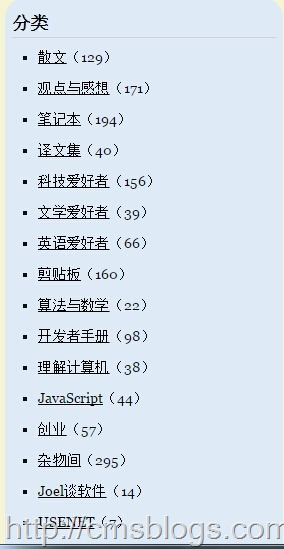

阮一峰，70后，英文名Frank。他原是上海财经大学世界经济博士研究生。主要研究宏观金融、货币政策与美国经济。于2008年6月获得博士学位。目前在上海一所当地大学（上海金融学院
国际经贸学院）任教。他本人也是一名IT技术人员，主要关注网站制作，并且对自由软件有着坚定不移的信念。

读他的博客是源于一个关于javascript
this的用法（[Javascript的this用法](http://www.ruanyifeng.com/blog/2010/04/using_this_keyword_in_javascript.html)），个人认为它的这篇博客写非常不错，然后再随便点点，随便看了几篇关于javascript的博文，写的都非常不错。LZ是一个javascript菜鸟，无法评判一个博客的好坏真正的价值，但是我认为对我有帮助的博文都是好博文，而他的博文通熟易懂、知识点评到位，每每都能戳中要点。不过他博客最让我吃惊的不在于这几篇博文，而在于他的博文分类

LZ粗略算了下，大概1500+篇博客，其中涉猎之广让我惊叹。在LZ看的博客当中起码包括如下几类：IT技术、互联网、英语、读书、影评，还有政治学、经济学。他所涉猎之广我除了佩服还是佩服。

8月份的时候购买了他的博客文集，总共包括两本：《 **如何变得有思想** 》、《 **一个寻找作者的读者**
》。这两本文集收录了他2004年——2013年的博客，对于以前没有追过他博客的人来说是一大福利，可以买着看看。我不论这文集给我带来了多少思考，或者与他产生了多少共鸣。起码里面两点是非常值得我们学习的：1、坚持10+年写博客，这个毅力、这种执着让人钦佩。2、他的知识面比较宽广，对各种事物都有深刻探寻的好奇心，和善于考据的思维方式，以及对于美好事物及感情的向往。

从此我变成他博客的追随者了！！！！

下本书：《如何变的有思想》、《黑客与画家》。

