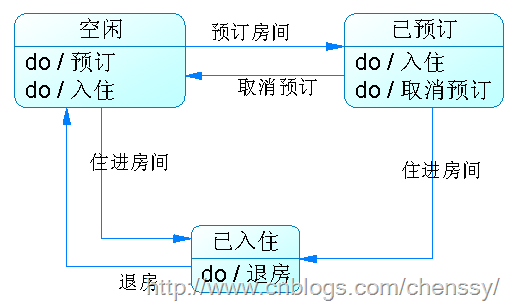

在介绍状态模式之前，我们先来看这样一个实例：你公司力排万难终于获得某个酒店的系统开发项目，并且最终落到了你的头上。下图是他们系统的主要工作(够简单)。

当你第一眼看到这个系统的时候你就看出来了这是一个状态图，每个框框都代表了房间的状态，箭头表示房间状态的转换。分析如下：房间有三个状态：空闲、已预订、已入住，状态与状态之间可以根据客户的动作来进行转换。定义每个状态的值。

    
    
    public static final int FREEMTIME_STATE = 0;  //空闲状态
        public static final int BOOKED_STATE = 1;     //已预订状态
        public static final int CHECKIN_STATE = 2;    //入住状态
        
        
        int state = FREEMTIME_STATE;     //初始状态

通过客户的动作将每个状态整合起来，对于这个“最简单”的方式肯定是if…else
if…else啦！所以这里我们就通过动作将所有的状态全面整合起来。分析得这里有四个动作：预订、入住、退订、退房。如下：

    
    
    /**
         * @desc 预订
         * @return void
         */
        public void bookRoom(){
            if(state == FREEMTIME_STATE){   //空闲可预订
                if(count > 0){
                    System.out.println("空闲房间，完成预订...");
                    state =  BOOKED_STATE;     //改变状态：已预订
                    count --;
                    //房间预订完了,提示客户没有房源了
                    if(count == 0){
                        System.out.println("不好意思,房间已经预订完,欢迎您下次光临...");
                    }
                }
                else{
                    System.out.println("不好意思,已经没有房间了....");
                }
            }
            else if(state == BOOKED_STATE){
                System.out.println("该房间已经被预订了...");
            }
            else if(state == CHECKIN_STATE){
                System.out.println("该房间已经有人入住了...");
            }
        }
        
        /**
         * @desc 入住
         * @return void
         */
        public void checkInRoom(){
            if(state == FREEMTIME_STATE){
                if(count > 0){
                    System.out.println("空闲房间，入住...");
                    state =  CHECKIN_STATE;     //改变状态：已预订
                    count --;
                    //房间预订完了,提示客户没有房源了
                    if(count == 0){
                        System.out.println("不好意思,房间已经预订完,欢迎您下次光临...");
                    }
                }
                else{
                    System.out.println("不好意思,已经没有房间了....");
                }
                
            }
            else if(state == BOOKED_STATE){
                if("如果该房间是您预订的"){
                    System.out.println("入住....");
                    state = CHECKIN_STATE;
                }
                else{
                    System.out.println("您没有预订该房间,请先预订...");
                }
            }
            else if(state == CHECKIN_STATE){
                System.out.println("该房间已经入住了...");
            }
        }
        
        /**
         * @desc 退订
         * @return void
         */
        public void unsubscribeRoom(){
            if(state == FREEMTIME_STATE){
            }
            else if(state == CHECKIN_STATE){
                
            }
            else if(state == BOOKED_STATE){
                System.out.println("已退订房间...");
                state = FREEMTIME_STATE;
                count ++;
            }
        }
        
        /**
         * @desc 退房
         * @return void
         */
        public void checkOutRoom(){
            if(state == FREEMTIME_STATE){
                
            }
            else if(state == BOOKED_STATE){
                
            }
            else if(state == CHECKIN_STATE){
                System.out.println("已退房..");
                state = FREEMTIME_STATE;
                count++;
            }
        }

对于上面的代码你是否满意呢？满意那么你就没有必要往下看了，不满意我们接着讲。

正当你完成这个“复杂”if..else if
…else时(我都写了一会儿)，你客户说，我们需要将某些房间保留下来以作为备用(standbyState)，于是你发现你悲剧了，因为你发现你要在所有的操作里都要判断该房间是否为备用房间。当你老大经过你身边的时候发现你正在纠结怎么改的时候，你老大就问你为什么不换一个角度思考以状态为原子来改变它的行为，而不是通过行为来改变状态呢？于是你就学到了
**状态模式。**

